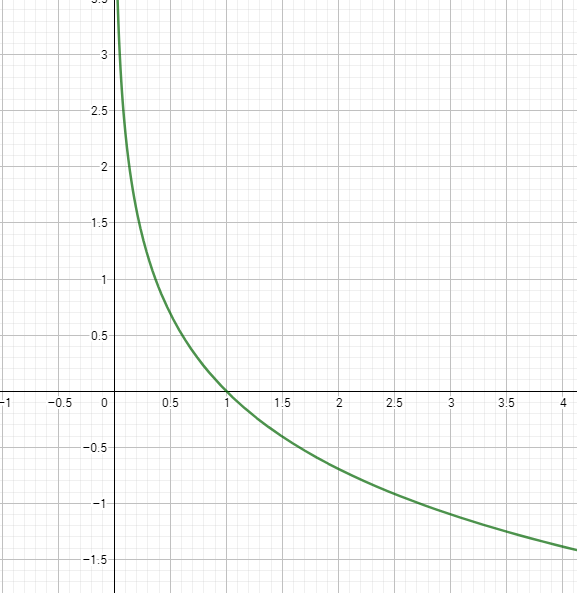
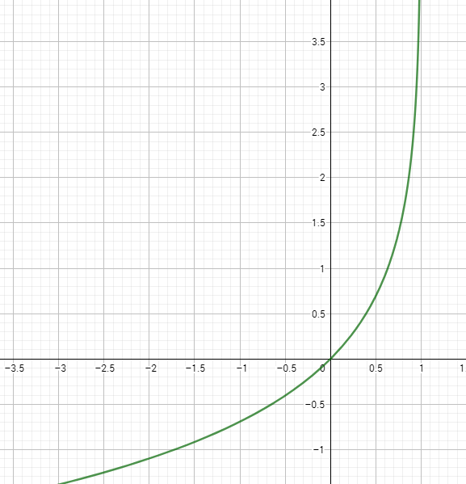

# 이중 분류

이중 분류(Binary
Classfication)는, 입력된 데이터에 따라 출력을 두 가지(0과 1)로 분류하는 기법이다.

기본적인 아이디어는 선형 회귀법과 비슷하다. 가설 함수로  모양을 사용하는 것을 동일하나, 활성화 함수로 보통 전에 보았던 Sigmoid 함수를 사용한다.

손실 함수도 모양이 다르다. 입력에 대한 가설 함수 와 실제 정답 데이터 가 있을 때, 가설 함수 는 다음과 같다.


정답 데이터가 1일 경우 먼저 살펴보자. 이 때는 가 손실 함수로 적용된다. 의 그래프를 보자.



이 그래프를 보면, x가 0일 때 함숫값은 무한대로 발산하고, 1일 때 0으로 감소하는 것을 볼 수 있다. 가 0에 가까워질수록 손실 함수의 출력은 무한대로 발산할 것이고, 1에 가까워질수록 0에 수렴할 것이다.

반대로 정답 데이터가 0일 경우를 살펴보자.  이 때의 손실 함수는  이다. 그래프를 보자.



그래프를 보면, x가 0일 때 함숫값이 0으로 수렴하고, 1일 때 무한대로 발산한다.

위의 내용을 정리해 보면, 이중 분류의 손실 함수는 현재 가설 함수의 예측이 틀릴수록 손실 함수의 값을 극단적으로 키워, 가중치의 수정을 빠르게 촉진시키는 역할을 한다. 따라서 이중 분류법에 적합한 손실 함수라고 할 수 있다.

그럼 이 함수를, 위처럼 두 개의 케이스로 나누지 않고 하나의 식으로 정리할 수는 없을까? 당연히 가능하다. y가 0 또는 1이라는 성질을 이용하면 된다. 다음처럼 정리할 수 있다.


이처럼 손실 함수를 구성하면, y의 값에 따라 둘 중 하나의 식이 사라져, 우리가 원하는 손실 함수를 얻어낼 수 있다.

실제 Tensorflow로 구현해보자.

```
import tensorflow as tf
import numpy as np
tf.set_random_seed(9297)

dataX = [[2, 3], [1, 2], [1, 1], [3, 1], [1, 0], [8, 7], [7, 5], [6, 6], [8, 6], [7, 7]]
dataY = [[0], [0], [0], [0], [0], [1], [1], [1], [1], [1]]

X = tf.placeholder(tf.float32)
Y = tf.placeholder(tf.float32)

W = tf.Variable(tf.random_normal([2, 1]))		# 입력이 2, 출력이 1
b = tf.Variable(tf.random_normal([1, 1]))

logits = tf.sigmoid(tf.matmul(X, W) + b)		# Sigmoid 적용
cost = tf.reduce_mean(-Y * tf.log(logits) - (1-Y) * tf.log(1-logits))		# 손실함수 적용

trainer = tf.train.GradientDescentOptimizer(learning_rate=0.1).minimize(cost)

with tf.Session() as sess:
    sess.run(tf.global_variables_initializer())

    for step in range(3001):
        cost_v, _ = sess.run([cost, trainer], feed_dict={X:dataX, Y:dataY})

        if step % 200 == 0:
            print(step, cost_v)

    print("[2, 2] :", sess.run(logits, feed_dict={X:[[6, 6]]}))
```
