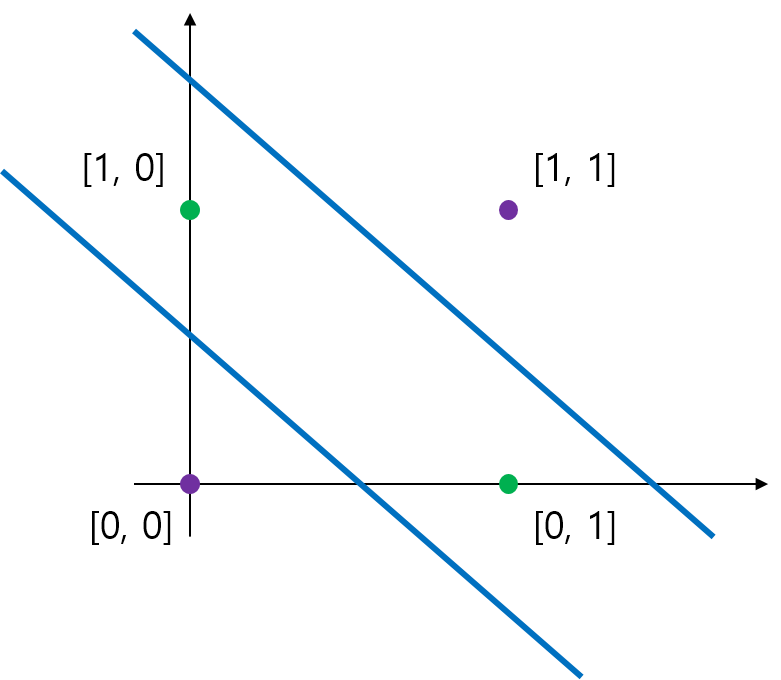
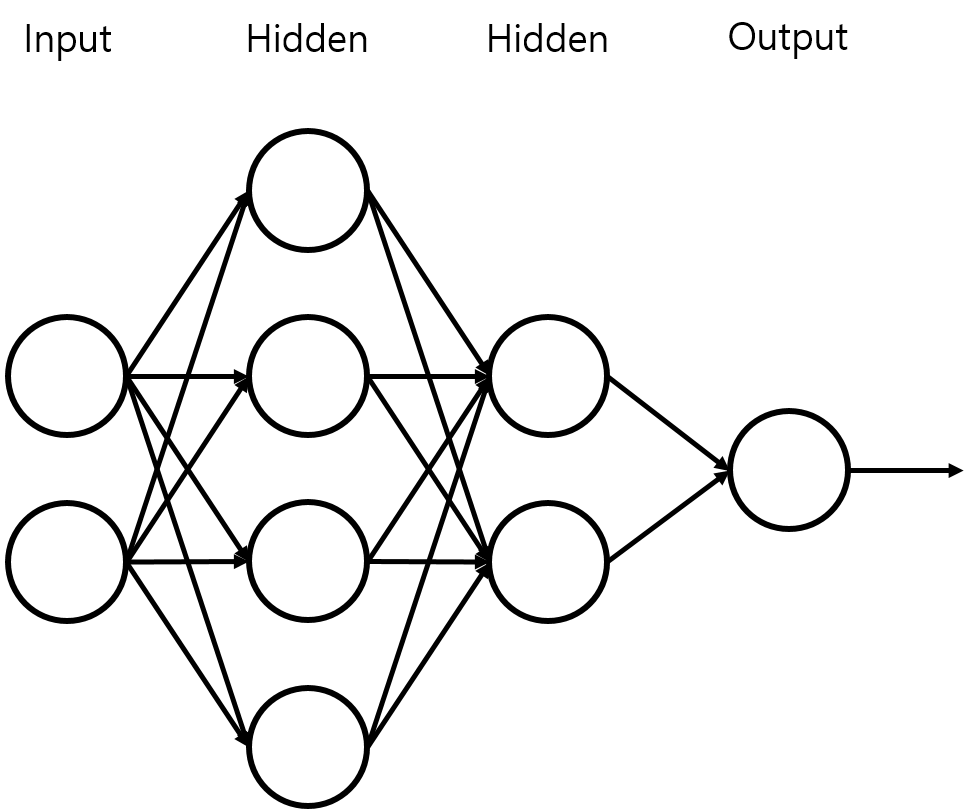

# XOR 문제

이번에는, 딥 러닝의 개념을 만들었다고 할 수 있는 __XOR 문제__ 를 알아보고 직접 구현해 보자.

첫 번째 글에서 보았듯이, AND와 OR은 특정한 가중치와 편향 값을 통해 단층 퍼셉트론으로도 구현이 가능했었다. 하지만 XOR은 불가능해서, 다층 퍼셉트론 망을 통해 구현했었다.


첫 번째 글에서 보았던 XOR 문제를 위한 다층 퍼셉트론 망의 구조이다. 여러 개의 단층 퍼셉트론을 연결하여 사이사이 가중치 간선으로 연결된 모습을 보여준다. 첫 번째 글에서는, 우리가 미리 가중치 값을 정해서 Forward Propagation 방법으로 XOR을 구현하였지만, 이제는 미리 네트워크의 구조를 만들어 놓고, XOR 게이트의 데이터를 준 후 신경망이 직접 알맞은 가중치와 편향을 찾아내도록 유도해 보자.

XOR 문제의 해결, 즉 데이터의 분류을 위해 우리는 아래의 파란 직선들과 같이 두 개 이상의 직선을 이용해야 할 것이다.



하나의 직선은 곧 하나의 단층 퍼셉트론을 의미하므로, XOR 문제를 해결하려면 다층 퍼셉트론 구조를 이용해야 함은 당연하다.

하지만 이 과정에서 신경망이 스스로 가중치의 변경을 통해 만들어내는 직선이 무조건 AND와 OR 퍼셉트론을 의미하는 직선은 아니다. 신경망은 그저 출력과 그로 인한 손실, 그리고 역전파에 의하여 수정되는 가중치와 편향을 가지고 임의의 직선을 만들어 낼 뿐이다. 그 직선은 매번 달라질 수 있지만, 최종적으로 그 직선들이 모여서 XOR 문제의 분류를 수행해 낸다는 점은 동일하게 작용한다.

그럼 이제, 실제로 XOR 문제를 구현해 보자.

행렬을 이용하여 수많은 퍼셉트론들로 이뤄진 한 Layer를 구현할 수 있다. 노드간의 연산은 행렬이 간단하게 처리해 주므로, 우리는 중간의 Hidden Layer의 모양을 어떻게 만들던지 상관이 없다. 행렬 연산을 할 수만 있으면, 어떤 형태로든 신경망의 구현이 가능하기 때문이다.

일단, 두 개의 히든 레이어를 둔 아래와 같은 방식의 네트워크를 구성해보자.



구현을 위해 몇 가지 사항들을 정리하고 시작하자.

수학적으로, 첫번째 히든 레이어로의 가중치는  크기, 두번째 히든 레이어로의 가중치는  크기, 출력 레이어로의 가중치는  이다. 편향도 각각  크기이다.

그리고 이 문제는 입력에 따라 출력이 두 가지로 나누어지는 이중 분류 문제이다. 따라서 이중 분류의 손실 함수를 써야 함은 물론이고, 각 레이어에 Sigmoid 활성화 함수를 적용해주어야 한다. 항등 함수를 적용할 경우 학습이 되지 않을 것이다. Sigmoid 활성화 함수의 식을 다시 보고 넘어가자.


이제, 본격적으로 Tensorflow 코드로 구현해 보자.

```
import tensorflow as tf
tf.set_random_seed(9297)

# 데이터 정의
dataX = [[0, 0], [0, 1], [1, 0], [1, 1]]
dataY = [[0], [1], [1], [0]]

X = tf.placeholder(tf.float32)
Y = tf.placeholder(tf.float32)

# 첫번째 Hidden layer로의 가중치와 편향
W1 = tf.Variable(tf.random_normal([2, 4]))
b1 = tf.Variable(tf.random_normal([4]))

# 두번째 Hidden layer로의 가중치와 편향
W2 = tf.Variable(tf.random_normal([4, 2]))
b2 = tf.Variable(tf.random_normal([2]))

# 출력 layer로의 가중치와 편향
W3 = tf.Variable(tf.random_normal([2, 1]))
b3 = tf.Variable(tf.random_normal([1]))

# 각 Layer들을 정의. 이전 층에서 들어오는 입력과 현재 층의 가중치, 편향을 이용해 구성함
# 활성화 함수는 Sigmoid 함수, 모든 층에 적용
layer1 = tf.sigmoid(tf.matmul(X, W1) + b1)
layer2 = tf.sigmoid(tf.matmul(layer1, W2) + b2)
hypothesis = tf.sigmoid(tf.matmul(layer2, W3) + b3)

# 이중 분류의 손실 함수
cost = -tf.reduce_mean(Y * tf.log(hypothesis) + (1-Y) * tf.log(1-hypothesis))

# 경사 하강법을 이용해 학습
trainer = tf.train.GradientDescentOptimizer(0.1).minimize(cost)

with tf.Session() as sess:
    sess.run(tf.global_variables_initializer())

    for step in range(30001):
        cost_v, _ = sess.run([cost, trainer], feed_dict={X:dataX, Y:dataY})

		# 200번 반복마다 현재 손실함수의 출력을 찍어줌
        if step % 200 == 0:
            print(step, cost_v)

	# 네트워크가 잘 학습했는지 테스트
    print(sess.run(hypothesis, feed_dict={X:dataX}))
```

실제로 이 파일을 실행하여, 결과 출력을 확인해 보자. 아마 다음과 비슷한 결과가 나올 것이다.

```
[[ 0.00214651]
 [ 0.99846315]
 [ 0.99831367]
 [ 0.00188661]]
```

이 결과는 우리의 신경망이 XOR 게이트를 매우 잘 학습했다는  것을 보여준다. 위에서부터 순서대로 입력 [0, 0], [0, 1], [1, 0], [1, 1] 을 의미하는데, [0, 0], [1, 1]에는 0에 매우 가까운 출력을 보여주고, [0, 1], [1, 0]에는 1에 매우 가까운 출력을 보여주기 때문이다.

이로써 신경망을 통해, XOR 게이트를 학습시켰다.
