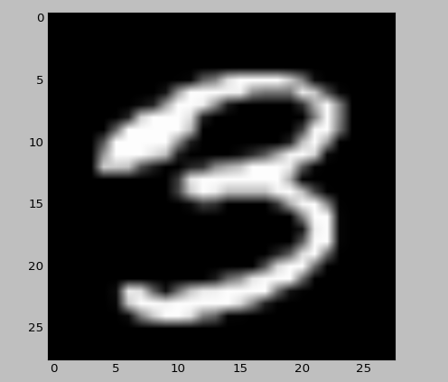
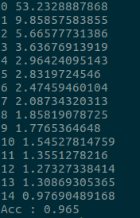

# 다층 신경망을 이용한 MNIST 분류

이번에는, MNIST 분류 문제의 정확도를 다층 신경망을 이용해서 더욱 향상시켜 보자. 또 당분간은, 신경망을 구축하여 운용하는 데에 필요한 기술들을 공부하는 데에 이 MNIST 분류 모델을 활용하도록 하겠다.

신경망의 진행 과정은 이전에 XOR 문제에서 다루었던 모양과 비슷하다. 그리고 앞으로도 비슷할 것이다. 신경망의 크기와 모양은 다양할 수 있겠으나, 행렬의 모양을 맞춰서 신경망을 구성하고 학습시킨다는 점은 동일하다.

MNIST 분류 문제는 결국 SOFTMAX를 이용하여 0~9의 10개 클래스로 이미지들을 분류해 내는 문제이다. 입력 데이터는 다음과 같이 시각화되는 28 x 28 크기 이미지 데이터이다.



이 데이터를 flatten하게 펴서, 28 x 28 = 784 길이의 1차원 벡터로 펴준 뒤 입력으로 사용할 것이다. 이것이 신경망의 모양을 간단하게 하는 지름길이기 때문이다. 그리고 이 신경망의 출력은, SOFTMAX 분류를 적용하기 위한 10 길이의 1차원 벡터이다. 이 출력을 SOFTMAX 함수에 입력해서 one-hot 벡터로 만들어 분류를 수행하게 된다.

입력 층과 출력 층 사이에 은닉 층의 모양과 갯수는 자유롭게 정하면 된다. 나는 256 크기의 은닉층을 2개 사용하기로 했다.

따라서 구성할 신경망의 가중치 행렬의 모양은 순서대로 (784 x 256), (256 x 256), (256 x 10) 일 것이다.

그리고 이번 모델에서, 본격적으로 ReLU 활성화 함수를 사용해 보자. 다층 신경망 모델에서 큰 역할을 한다고 한다.

먼저, 데이터 세트를 불러 오고 X, Y placeholder를 만들어 주자.

```
import tensorflow as tf
from tensorflow.examples.tutorials.mnist import input_data
tf.set_random_seed(9297)

mnist = input_data.read_data_sets('MNIST_data/', one_hot=True)

X = tf.placeholder(tf.float32)
Y = tf.placeholder(tf.float32)
```

그 다음, 우리의 모델을 만들어 주자. 위에서 보았던 것 처럼, 세 개의 가중치와 세 개의 편향, 세 개의 출력 퍼셉트론이 필요하다. 미리 설계해 놓은 행렬 모양으로 만들어 주자.

```
W1 = tf.Variable(tf.random_normal([784, 256]))    # Weight 1
W2 = tf.Variable(tf.random_normal([256, 256]))    # Weight 2
W3 = tf.Variable(tf.random_normal([256, 10]))     # Weight 3
b1 = tf.Variable(tf.random_normal([256]))         # Bias 1
b2 = tf.Variable(tf.random_normal([256]))         # Bias 2
b3 = tf.Variable(tf.random_normal([10]))          # Bias 3

layer1 = tf.nn.relu(tf.matmul(X, W1) + b1)        # Layer 1 output perceptron
layer2 = tf.nn.relu(tf.matmul(layer1, W2) + b2)   # Layer 2 output perceptron
logits = tf.matmul(layer2, W3) + b3               # Entire network output perceptron
```

이제 손실 함수를 정의할 차례이다. 지금까지는 SOFTMAX 함수의 Cross-Entropy 오차를 직접 구현하여 사용해 왔다. 하지만 Tensorflow에는 SOFTMAX 함수의 구현을 훨씬 간단하게 할 수 있는 방법을 제공한다. 바로 `softmax_cross_entropy_with_logits` 함수를 이용한 방법이다.

```
cost = tf.reduce_mean(tf.nn.softmax_cross_entropy_with_logits(logits=logits, labels=Y))
```

`softmax_cross_entropy_with_logits` 함수에 우리의 최종 가설 함수와 one-hot 인코딩된 정답 벡터를 넣어 주면, 자동으로 Cross-Entropy 오차를 적용해서 손실 함수를 계산해 준다. 이 함수의 출력은 여러 입력에 대한 손실들의 벡터로 나오므로, `tf.reduce_mean()` 함수를 사용하여 차원을 줄이고 손실들의 평균을 하나의 값으로 계산해 낸다.

그리고 손실을 줄여 나갈 방법을 설정한다.
```
trainer = tf.train.AdamOptimizer(0.01).minimize(cost)
```

아직 자세히 알아보지 않은 Adam Optimizer를 사용하였다. 미리 선행으로 읽어 보니, 손실 최소화를 위해 무슨 방법을 써야 할지 정확히 감이 잡히지 않을 때는 Adam을 쓴다고 한다.

그리고 우리는 Batch 학습을 구현함과 동시에 여러번의 반복 학습을 시행할 것이다. 전체 데이터를 한번 싹 도는 단위를 한 __Epoch__ 이라고 한다. 몇 Epoch 반복하여 학습할지 정하고,  한번 학습 시마다 불러와 시행할 데이터의 개수를 정한다.

```
epochs = 15     # learning epochs
batch_size=100  # one batch size in one training iterating
```

여기서는 15번의 반복 학습을 시행하기로 정했고, 한번의 학습은 100개의 데이터를 꺼내와 시행하기로 설정했다.

그리고 아래의 코드와 같이, 학습을 시행한다.

```
with tf.Session() as sess:
    sess.run(tf.global_variables_initializer())

    # training all train datas for all epochs(15)
    for epoch in range(epochs):
        avg_cost = 0
        batches = int(mnist.train.num_examples / batch_size)    # get all amount of batches

        for step in range(batches):
            batchX, batchY = mnist.train.next_batch(batch_size)
            cost_v, _ = sess.run([cost, trainer], feed_dict={X:batchX, Y:batchY})

            # sum of 550 (cost/batches) : it means this training's average of cost
            avg_cost += cost_v / batches

        print(epoch, avg_cost)
```

```avg_cost``` 변수는, 한 Epoch의 손실의 평균을 의미한다. 코드를 보면, ```batches``` 변수가 한번에 꺼내올 데이터 크기를 바탕으로 반복의 횟수를 결정하고 있다. ```batches``` x ```batch_size``` = ```mnist.train.num_examples```이므로, 한 Epoch에 모든 학습 데이터를 한 번 순회할 수 있게 된다. 그리고 안쪽 반복문을 한 번 돌때마다, 그 때의 데이터 100개에 대한 손실을 구한다. 그리고 그때마다 그 값을 반복의 횟수만큼 나눠서, 한 Epoch의 평균 손실을 구해낼 수 있게 된다. 그리고 그 평균 손실을 출력하는 것을 코드에서 볼 수 있다.

```
    correct = tf.equal(tf.argmax(logits, 1), tf.argmax(Y, 1))
    accuracy = tf.reduce_mean(tf.cast(correct, tf.float32))
    print('Acc :', sess.run(accuracy, feed_dict={X:mnist.test.images, Y:mnist.test.labels}))
```
그리고 마지막으로, 전체의 정확도를 구해 본다. Y 정답 라벨과 현재 가설 함수의 예측이 동일한지, 전체 test image들을 이용해 확인하여, 정확도를 산출하고 있다.

### 실행 결과

위의 코드를 직접 돌려서, 정확도를 확인해 보자.



신경망 없이 SOFTMAX 분류만을 수행했을 때는 88%정도의 정확도를 보였는데, 간단한 신경망의 구성으로 96.5%의 정확도를 볼 수 있었다.

이래서 신경망, 신경망, 딥러닝, 딥러닝 하는구나 ㅎㅎ
