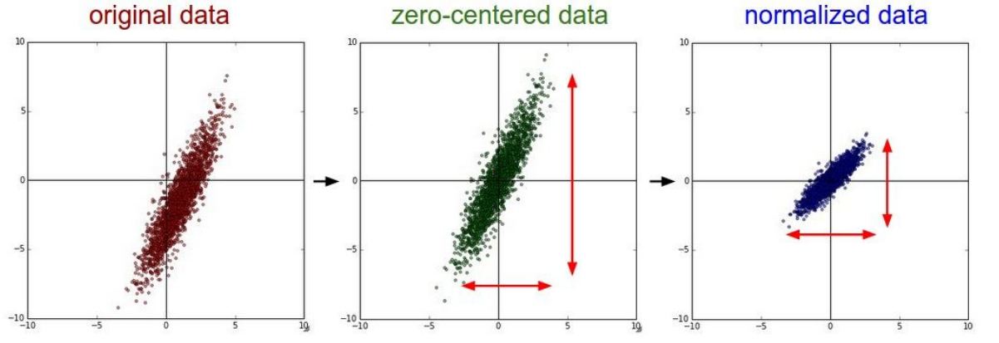

# 데이터의 전처리

중간중간 몇 개의 Kaggle 내 데이터셋을 이용해 내가 만든 모델들을 검증해보았다. 그 과정에서 느낀 것은, 딥 러닝 모델을 만들어 학습시키고 적용하기 위해서는 학습을 위한 데이터 자체를 학습하기 좋게 가공해주는 일이 중요하다는 것이다. 실제 연구자 분들의 말씀을 들어 보면, 하나의 모델을 개발할 때 신경망을 구축하는데 드는 시간보다 데이터를 알맞게 전처리하는 데 드는 시간이 훨씬 오래 걸리고, 훨씬 많은 코드가 들어간다고 한다.

오늘은 대표적이면서도 간단한 전처리 방법을 잠깐 살펴보자.

아래의 사진은 Stanford University의  Lecture 6 슬라이드에서 가져왔다.



### Zero Centered Data

처음 우리의 데이터가 맨 왼쪽 빨간 그래프와 비슷하게 생겼다고 가정하자. 물론 현실의 데이터가 저렇게 예쁠 수가 없지만, 예제이기 때문에 이해해 주자. 빨간 그래프의 모양을 보이는 데이터의 각 원소에 전체의 평균을 빼주는 작업을 하면, 두번째의 초록 데이터와 같이 중앙이 0으로 맞춰진 __Zero Centered__ 데이터를 만들 수 있다. 데이터의 기준점을 맞춰주는 것 만으로도 큰 도움이 될 수 있다.

직접 간단하게 구현해보자.

```
import numpy as np

data = X.arange(-7, 13, 0.01)
print(data)
data -= np.mean(data, axis=0)
print(data)
```

위 코드의 실행 결과는 다음과 같다.
```
[ -7.    -6.99  -6.98 ...,  12.97  12.98  12.99]
[-9.995 -9.985 -9.975 ...,  9.975  9.985  9.995]
```

원래의 `data` 는 -7부터 13까지, 0.01 간격의 실수 배열이 저장된 데이터였다. 당연히 데이터의 중심점은 0이 아니라 3이었다. 하지만 모든 원소에 전체 데이터의 평균을 빼주는 작업을 수행한 후, 데이터의 중심점이 0으로 맞추어진 것을 볼 수 있었다.

### Normalized Data

물론 위 사진의 예시 데이터는 너무 비정상적으로 예쁘지만, 데이터의 __일반화(Normalize)__ 를 위한 예시로써 보자. 일반화 작업은 보통 편차가 너무 큰 데이터를 중심으로 모으기 위한 방법이다. 데이터의 편차가 너무 크다면, 예측을 위한 가설 함수를 찾아내기 어려울 것이다. 자연스럽게 학습은 진행되지 않는다. 따라서 편차를 줄이고 중심으로 데이터를 좁게 모아서, 학습하기 용이한 형태의 데이터로 만들어주는 것이 __일반화(Normalize)__ 이다. 위의 사진에서, 초록색 그래프의 데이터를 파란색 그래프의 모양과 같이 모아주는 것이 일반화이다.

일반화도 간단히 구현해 보자. Zero Centered에서 구현한 코드 뒤에 붙여 보자.

```
X /= np.std(X, axis=0)    # std : standard deviation
print(X)
```

`np.std` 함수는 입력 데이터의 표준 편차(Standard Deviation)를 반환한다. 데이터의 모든 원소에 전체 데이터의 표준 편차를 나누어서, 데이터를 평균, 즉 원점에 가깝게 모으는 것이다. 코드의 실행 결과는 다음과 같다.

```
[ -7.    -6.99  -6.98 ...,  12.97  12.98  12.99]
[-9.995 -9.985 -9.975 ...,  9.975  9.985  9.995]
[-1.731185   -1.72945295 -1.7277209  ...,  1.7277209   1.72945295  1.731185  ]
```

데이터의 간격 비율과 원점은 유지하면서, 데이터의 편차, 즉 넓게 퍼진 정도를 크게 줄인 것을 볼 수 있었다.

### Conclusion

어떤 데이터를 어떤 방법으로 학습하냐에 따라 데이터의 전처리 과정은 무척 다양할 수 있다. 이 글에서는 그 중 가장 기본적이고 범용적인 방법 2가지를 살펴 보았다. 데이터의 특성과 학습 방법에 따른 전처리의 방법 결정과 적합한 알고리즘 제작을 위해서는, 많은 경험이 필요할 것 같다.
