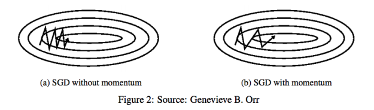
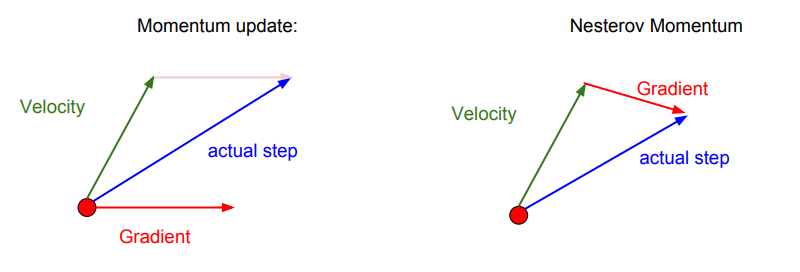

# 최적화 알고리즘 1. SGD, Momentum, NAG
지금까지 공부하면서, 대부분의 경우에 최적화(Optimization, 손실 최소화) 알고리즘으로 Gradient Descent 알고리즘을 사용했었다. 하지만 저번 MNIST 분류를 구현하면서, Adam이라는 새로운 Optimization 알고리즘을 사용했다. 정확히 어떤 원리로 작동하는 알고리즘인지 모르는 채로 사용했었는데, 이번 기회에 Optimization 알고리즘들을 한번 정리해보려고 한다.

이번 글에서는 SGD(Stochastic Gradient Descent), Momentum, NAG(Nesterov Accelerated Gradient) 세 가지에 대해 알아보자.

### SGD (Stochastic Gradient Descent)
__확률적 경사 하강법__ 이라고 불리는 알고리즘이다. 알고리즘의 동작 방식은 Gradient Descent와 동일하다. 아래와 같이, 현재 가중치 매개 변수의 값에서의 손실 함수의 미분값을 이용하여 가중치를 업데이트한다.

이 경사 하강법을 모든 Training Set을 기반으로 수행하는 것을 __Batch Gradient Descent__ 이라고 한다. 이 방법은 전체 학습 데이터에 대한 손실 함수를 계산하여 가중치를 갱신할 수 있으므로 정확한 학습이 가능하지만, 데이터가 많아질 수록 너무 많은 연산이 필요하게 된다.

그래서 모든 Training Set이 아닌, 세트의 일부만을 가지고 Loss Function을 계산한 후 Gradient Descent 알고리즘을 적용하여 가중치를 갱신하는 방법이 바로 __Stochastic Gradient Descent__ 이다. 그리고 이 조그마한 세트의 일부를 __Mini Batch__ 라고 한다. 배치 학습을 수행할 때의 그것과 의미가 같다.

SGD를 사용하면 그때 그때 훨씬 적은 데이터를 이용해 최적화를 진행하므로 계산량이 크지 않아 속도가 비교적으로 빠르다. 최적화의 결과 또한 Batch Gradient Descent와 비슷한 결과로 수렴된다. 오히려 더 좋은 방향으로 수렴할 가능성도 생긴다.

### Momentum
SGD는 Local Minimum에 매우 취약한 알고리즘이다. 아래의 그림은 여러 최적화 알고리즘들의 수렴 모습인데, SGD는 결국 Local Minimum에 빠지고 마는 모습을 보여 준다.

SGD의 문제점을 해결하기 위해 수많은 기법들이 고안되었고, 그 중 하나가 __Momentum__ 이다.

Momentum의 사전적 뜻은 '탄력, 추진력' 등이다. Momentum 기법은 사전적 의미 그대로, Gradient Descent에 의해 가중치가 변화하는 방향에 탄력 또는 추진력을 주는 기법이다. 수식으로 먼저 보자.

는 물리에서 말하는 '속도' 라고 생각하면 편하다. 현재 Gradient Descent 알고리즘에 의해 계산된 이동 방향과 이동량을 이용해 속도를 변화시킨다. 그리고, 가중치를 그 
'속도'만큼 변화시켜주고 있는 것을 볼 수 있다. 보통 에는 0.9등의 값을 준다고 한다.

이렇게 가중치를 업데이트하게 되면, 가중치는 현재 기울기()의 방향으로 __가속__ 되어 업데이트된다. 따라서 최적값과 멀리 떨어져있을 때는 최적화에 가속이 붙고,  항이 이전의 속도를 기억하므로 최적화 이상으로 업데이트되어 다시 값이 튀었을 때 빠르게 잡아줄 수도 있다. 또한 기울기에 의한 갱신량이 0일 때,  항에 의해 이동하는 거리가 생기므로, Local Minimum에 빠질 확률을 줄여줄 수 있다.

아래의 그림은 Momentum을 적용한 최적화와 그렇지 않은 최적화의 가중치 갱신 경로를 보여주고 있다.

### NAG (Nesterov Accelerated Gradient)
NAG는 Momentum을 약간 변형한 기법이다. Momentum이 기울기와 현재의 속도를 동시에 고려해서 다음 이동 방향과 속도를 결정한다면, NAG는 일단 현재 속도로 이동한 후 기울기를 고려해서 다음 이동 방향을 정한다. 식으로 보면 다음과 같다.

먼저 의 속도로 이동한 후, 그 결과의 기울기를 이용하여 속도를 갱신하고 있다. 이를 그림으로 보면 다음과 같을 것이다. 그림은 CS231n의 슬라이드에서 가져왔다.

NAG는 일반 Momentum보다 평균적으로 더 좋은 성능을 보인다. 일반 Momentum 방식은 기울기에 따라 이동을 한 후 속도에 따라 다시 이동하는 방식이지만, NAG는 속도에 따라 미리 이동한 후 기울기를 고려하여 속도를 변화시키기 때문에, Momentum의 속도를 이용한 빠른 이동이라는 이점을 살리면서 더욱 안정적인 이동을 할 수 있게 된다.
