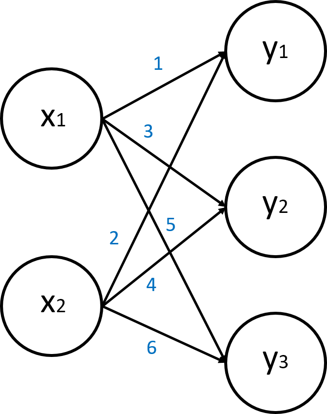

# 행렬곱과 신경망

다음과 같은 신경망이 있다고 가정하자.



이 신경망 그래프에서, 간선의 수치는 Weight(가중치)를 의미한다. 입력이 2개, 출력층 노드가 3개인 네트워크이므로, 위의 사진에서 보이듯이 Weight는 총 6개의 값이 존재하게 된다.

이를 지금까지 구현해왔던 퍼셉트론의 형태로 구현해보자.

```
def pctn(x1, x2):
    y1 = 1*x1 + 2*x2
    y2 = 3*x1 + 4*x2
    y3 = 5*x1 + 6*x2
    return y1, y2, y3

print(pctn(3, 5))
```

결과는 다음과 같이, 세 개의 노드 출력을 잘 보여주고 있는 것을 볼 수 있다.

```
(13, 29, 45)
```

하지만 이렇게 직접 구현을 하게 되면, 노드가 많아지고 레이어가 깊어지면 코드의 길이가 기하급수적으로 늘어날 것이다. 그러나 행렬로 이 연산을 간단히 구현할 수 있다.

입력 행렬  와 가중치 행렬  을 곱하여 출력  을 얻을 수 있다.

행렬곱의 성질에 의해, 위의 신경망에서 본 Weight들을 직접 행렬로 나타내면,  으로 나타낼 수 있다. 

이제 처음의 신경망을 행렬곱과 위의 가중치 행렬 를 이용하여 구현해 보자.


```
import numpy as np

def pctn(X):
    W = np.array([[1, 3, 5], [2, 4, 6]])
    return np.dot(X, W)

X = np.array([3, 5])
print(pctn(X))
```

`np.dot()` 함수로 행렬곱을 수행합니다. 결과는 다행히 잘 나오는 것을 볼 수 있습니다.
```
[13, 29, 45]
```

주의할 점은, 원래 행렬곱의 성질과 동일하게, 대응하는 차원의 원소 수를 맞춰야 연산이 가능하다는 것이다.  크기 행렬  와  크기 행렬 를 연산한  행렬의 크기는  이다. 이때  이면, 행렬 연산을 할 수 없다.
