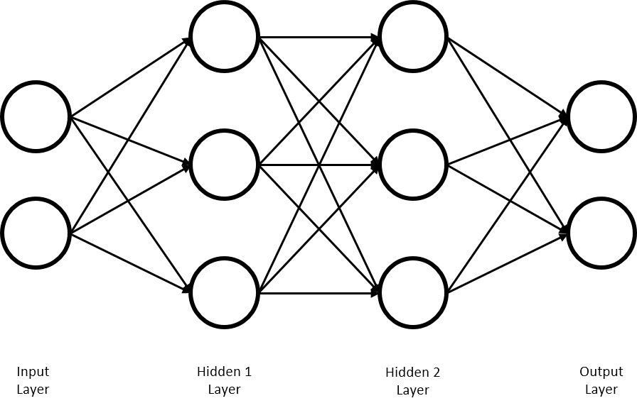
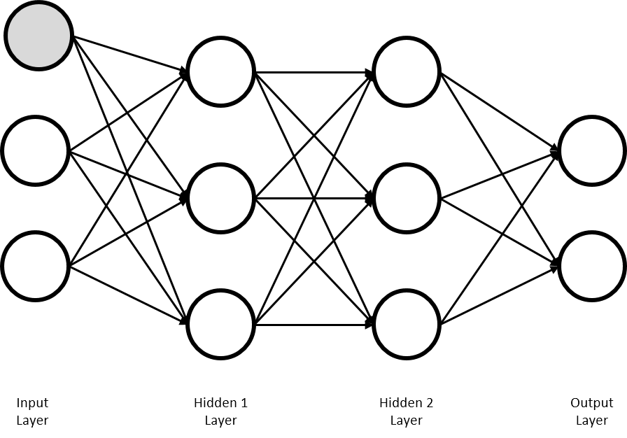
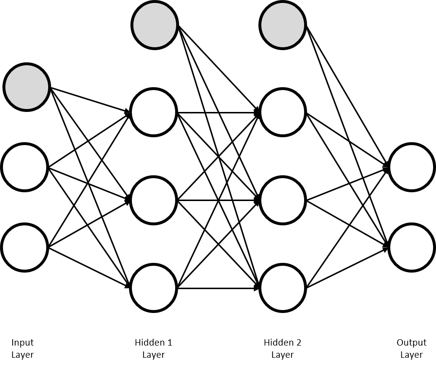

# 행렬곱을 이용한 다층 신경망



이 형태의 다층 신경망을 구현해 보자.

이번 신경망에는, 편향(Bias)도 추가해 보자.



편향은 입력 층 뿐만이 아니라, 모든 은닉층에 필요하다.



##### Hidden 1 Layer
그럼, Input Layer에서 Hidden 1 Layer로 가는 연산 먼저 구현해보자. 입력 노드가 2개, 은닉 1층의 노드가 3개이므로, 가중치의 모양은 ) 행렬이다. 여기에, Bias는 그저 원소간 덧셈을 수행을 하는 역할이므로, 은닉 1층의 노드 개수에 따라 크기는 3이다. 여기서 알 수 있는 사실은, Bias의 크기는 다음 Layer의 모양과 크기에 맞춰주면 된다는 것이다.

이제 이를 실제로 구현해 보자.

```
import numpy as np

X = np.array([1.0, 0.5])
W1 = np.array([[0.1, 0.3, 0.5], [0.2, 0.4, 0.6]])
b1 = np.array([0.1, 0.2, 0.3])

layer1 = np.dot(X, W1) + b1
print(layer1)
```

결과는 당연히 Bias가 잘 적용되어 나온다.
```
[ 0.23  0.49  0.75]
```

하나 잊은 것이 있는데, 다층 신경망을 구성할 때에는 활성화 함수의 선택이 중요하다. 이번 구현에는 Sigmoid 함수를 사용하도록 하겠다. Sigmoid 함수를 구현한 다음, 레이어에 적용시켜 준다.

```
def sigmoid(x):
    return np.array((1/1+np.exp(-x)))
```
```
layer1 = sigmoid(np.dot(X, W1) + b1)
print(layer1)
```

결과는 Sigmoid 함수가 적용된 형태로 나타난다.
```
[ 1.74081822  1.4965853   1.33287108]
```

이로써 은닉 1층이 완성되었다.

##### Hidden 2 Layer

은닉 2층은, 은닉 1층의 노드 3개의 출력을 입력으로 받는다.
그러므로 가중치 행렬은  크기이고, Bias도 3 크기이다. 은닉 1층과 같이 활성화 함수로 Sigmoid를 사용하여 2층을 구현해보자.
```
W2 = np.array([[0.1, 0.4, 0.7], [0.2, 0.5, 0.8], [0.3, 0.6, 0.9]])
b2 = np.array([0.1, 0.2, 0.3])
layer2 = sigmoid(np.dot(layer1, W2) + b2)

print(layer2)
```

2층의 출력 결과는 다음과 같다.
```
[ 1.37784916  1.08678317  1.01993208]
```

##### Output Layer

이제 출력층을 구현해보자. 출력층으로 들어오는 입력이 3개이고 출력층의 노드는 2개이니, Weight는  크기이고, bias는 2 크기이다. 출력층에서 활성화 함수는 따로 사용되지 않고, 항등 함수를 사용한다.
```
W3 = np.array([[0.1, 0.4], [0.2, 0.5], [0.3, 0.6]])
b3 = np.array([0.1, 0.2])
output = np.dot(layer2, W3) + b3

print(output)
```
신경망의 출력 결과는 다음과 같다.
```
[ 0.76112117  1.90649049]
```
이로써 처음 설계한 신경망의 구현이 완료되었다. 이 신경망에서는 Weight와 Bias 신호가 뒤에서 앞으로(forward) 전파(propagation)된다.