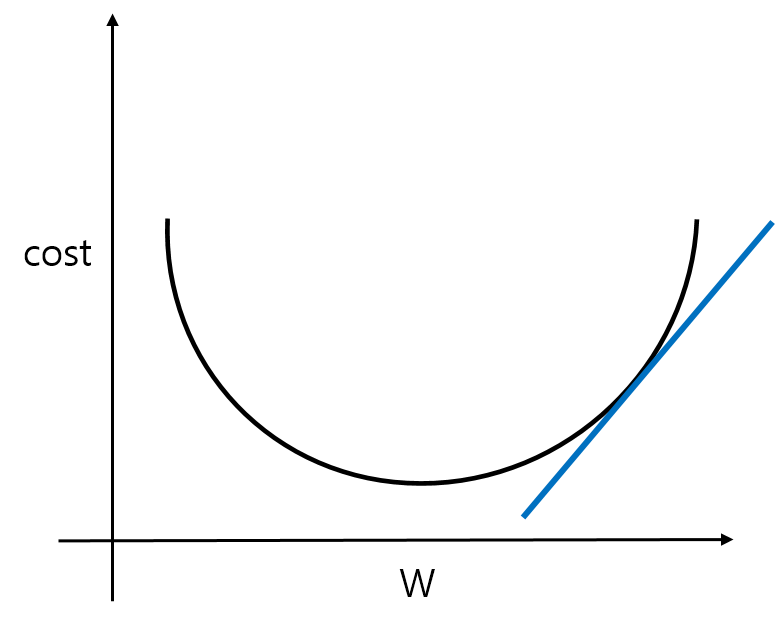

# 경사 하강법

경사 하강법(Gradient Descent Method)는, 손실 함수를 최소화 하는 대표적인 방법이다.

함수의 기울기가 가리키는 방향은, 그 지점에서 함수의 출력 값을 가장 크게 줄이는 방향이다. 경사 하강법은 이 특징을 이용하는데, 함수의 현재 위치에서의 기울기를 구해서, 그 방향으로 일정 거리만큼 이동하는 작업을 반복하는 알고리즘이다.

아래의 손실 함수를 보자.

x축의 W는 가중치(Weight)이고, y축의 cost는 W에 의한 손실 함수의 출력을 나타낸다.

현재 점에서 W에 대해 손실 함수의 미분을 수행한다. 그러면 그 점에서의 순간 변화량 값이 나오게 되는데, 이를 그림으로 나타내면, 다음과 같이 직선처럼 나타난다.

이제 이 미분값을 이용하여 실제로 손실 함수의 출력이 줄어드는 쪽으로 W를 수정시켜야 한다. 가만히 보면, 미분값의 부호와 반대 방향으로 이동해야 출력이 더 낮아진다는 것을 알 수 있다.

손실 함수의 모든 구간에서의 최솟값을 Global Minimum이라고 한다. 신경망을 학습 할 때, 경사 하강법을 이용하여 손실 함수를 최소화하는 작업은 곧 Global Minimum을 찾는 일과 동일하다. 

변수 , 을 가지고 있는 손실 함수에서의 경사 하강법을 식으로 나타내면 다음과 같다.

한 마디로, 각 변수의 현재 기울기를 구해서, 그 값이 손실 함수 에 얼마나 영향을 미칠지를 결정하는 함수이다. 여기서 는, 기울기가 실제로 손실 함수에 미칠 영향을 결정하는 Hyper Parameter로, 매개변수의 변화 크기를 결정한다.

그럼, 신경망에서의 기울기는 어떻게 될 지 알아보자.

가중치가 , 손실 함수가 일때, 이는 실제로

이다.

이 때 의 각 원소는,  각각이 변화함에 따라 에 미치는 영향을 나타낸다.
