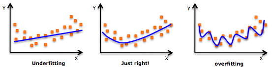

# Overfitting(과적합)의 방지

이번 글에서는, 신경망 모델을 만들 때에 큰 문제 중 하나인 __Overfitting(오버피팅, 과적합)__ 에 대해 알아보자.

오버피팅은 한마디로, __학습 데이터에 너무 딱 맞는__ 학습 결과를 가지는 것이다. 아래의 사진을 보자.

세 개의 그림은 순서대로 학습이 너무 덜 된 상태, 알맞게 학습된 상태, 오버피팅이 발생한 상태를 보여준다. 각각의 파란 선이 예측을 위한 가설 함수의 모양이 된다. 두 번째 그림의 가설 함수가 가장 이상적인 학습된 모양인데, 저 상태에서 새로운 데이터가 입력되어도, 옳은 예측을 할 확률이 높다. 하지만 세번째의 오버피팅된 학습 모양에 새로운 데이터가 입력될 경우, 학습 데이터와 조금이라도 차이가 있는 데이터라면 예측이 크게 빗나갈 것이다. 이는 과도한 학습으로 인해 가설 함수가 학습 데이터에 너무 딱 들어맞는 모양이 되었기 때문이다.

오버피팅의 방지를 위한 정말 다양한 방법이 존재한다. 간단한 세 가지 방법을 여기서 알아보자.

### 학습 데이터 추가
당연한 이야기지만, 학습 데이터가 더 많아지면 오버피팅되기 어려운 환경이 조성된다. 그리고 학습 데이터가 더 많을수록, 예측 함수가 더욱 일반화된 모양을 가질 수 있다. 데이터가 적을수록 학습 데이터의 모양에 맞게 함수를 _구부리기가_ 쉬워진다.

### 특징(Feature)의 갯수 줄이기
특징(Feature)란, 어떤 데이터 내에서 같은 의미를 가지는 일부 데이터들의 집합을 의미한다. 예를 들어, 신체 치수와 수명과의 관계를 나타낸 다음 예시 데이터가 있다고 하자.

Height|Weight|Feet Size|Age
-|-|-|-
150|55|235|70
165|70|260|80
170|100|270|57
155|200|240|45
...|...|...|...

모든 데이터를 통해 학습을 진행해도 상관이 없다. 하지만 여기서 나이에 직접적인 관계가 제일 적은 Feature인 Feet Size를 제외하고 Height와 Weight만을 이용해 학습을 진행한다면, 돌발적인 Feet Size의 영향을 적게 받는 더욱 일반적인 학습 결과를 보여줄 것이다.

일반적으로 Feature의 갯수가 너무 많으면, 실제 테스트 데이터의 다양한 상황에 대처하기 힘들어질 수 있다. 특정 Feature가 예측 결과에 어떤 영향을 미치는지 파악해서, 적절히 Feature의 갯수를 줄이는 것이 필요해 보인다.

### 가중치 정규화 (Regularization)
마지막으로, 효과적으로 오버피팅을 방지할 수 있는 방법인 가중치의 __정규화 (Regularization)__ 에 대해 알아보자. 가중치 정규화는, 큰 값을 가진 가중치나 학습 데이터에 특화되어 발달하고 있는 가중치를 일반화시키고 가중치 값을 최대한 멀리 퍼지게 하는 것을 목표로 한다.

대표적인 정규화 방법에는 두 가지가 있다.

#### L2 Regularization
간단한 정규화 방법이다. 손실 함수 식의 끝에 를 더해주는 방법이다. 여기서 는 Regularization Strength로, 정규화를 얼마나 강하게 수행할 것인지를 결정한다.

손실 함수 끝에 더하는 는, 가중치가 큰 값을 가질 수록 제약을 크게 걸어주는 역할을 한다. 신경망은 손실 함수의 값이 클수록 값을 크게 줄이려고 하므로, 저 값에 의하여 값이 큰 가중치는 더욱 빠르게 감소하게 된다. 이는 가중치의 편차를 줄여 더욱 일반화시키는 결과를 낳는다.

#### L1 Regularization
L2와 달리, 이 정규화 방법은 손실 함수 식의 끝에  를 더하는 것이다. L1 regularization은 최적화 과정 동안 가중치 벡터들을 sparse하게(거의 0에 가깝게) 만드는 흥미로운 특성이 있다. 따라서 이 정규화 방법을 적용한 예측 함수는 돌발적인(noisy) 입력 데이터에 거의 영향을 받지 않는다.

#### Elastic Net Regularization
L1 Regularization과 L2 Regularization을 같이 사용하는 방법이다. 손실 함수의 끝에  을 더해준다. L1과 L2 부분에 각각 들어가는 Regularization Strength 는 다르다.

#### Conclusion
데이터와 모델의 특성에 따라 사용하는 Regularization의 방법도 달라지겠지만, 보통 L2 Regularization을 사용한다고 한다. 그냥 왠만한 상황에서는 L2를 사용한다고 보면 되겠다.
