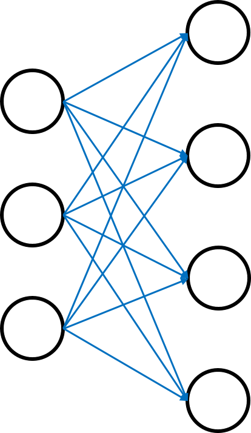
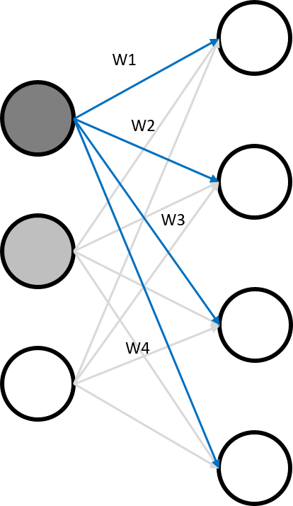
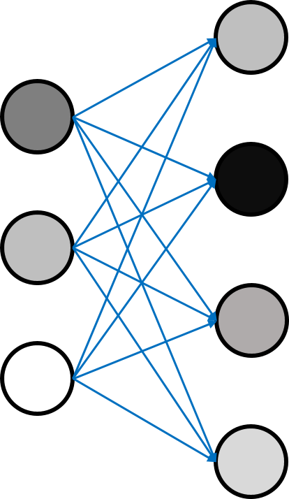
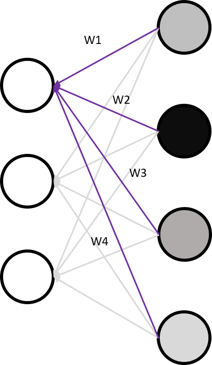
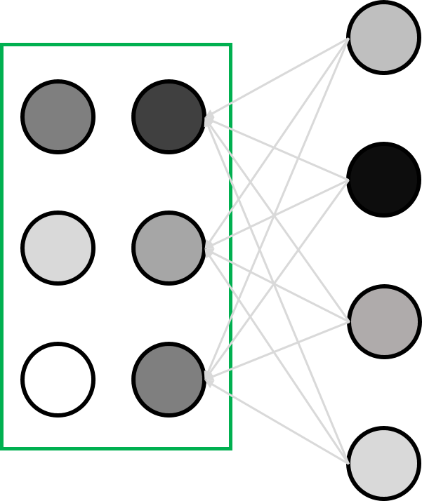

# Weight의 초기화
신경망의 성능을 더욱 끌어올리는 학습을 하기 위한 방법 중 하나로, 가중치(Weight)를 적절히 초기화해주는 것이 있다. 이번에는, Weight를 적절히 초기화하는 방법에 대해 알아보자.

먼저, '초기화'라는 작업을 수행할 때에 가장 먼저 떠오르는 것을 시도해보자. 모두 0으로 초기화하는 것이다. 실제로 이 방법은 딥 러닝의 초기에 많이 사용되었다. 하지만 이 초기화 방법은 잘못된 것이라는 결론이 났다. 단순히 생각해서, 처음의 가중치가 모두 0으로 초기화되면, 신경망 내의 모든 뉴런들이 모두 동일한 연산 결과를 내놓을 것이고, 그렇게 되면 역전파 과정에서 얻는 Gradient 값이 모두 동일해지게 되어 학습의 의미가 사라지기 때문이다.

이번에는, 모든 가중치의 초깃값을 Random하게 설정해 보자. 분명히 모두 0으로 초기화하는 것보다는 낫고, 다양하게 값이 분화할 수도 있어 괜찮은 것 같다. 하지만 여전히 문제점은 존재한다. 난수의 범위가 넓으면 편차가 자연스럽게 커져 가중치 업데이트가 오래 걸리거나 안될 수 있다.

그럼, 0에 가까운 작은 실수 난수들로 초기화하면 편차가 좁으니 해결되지 않을까? 좋은 방법 같지만, 아쉽게도 이 경우에는 역전파 과정에서 Gradient(기울기) 값이 사라지는 결과를 초래할 수 있다. 이렇게 Gradient 값이 희미해지거나 사라지는 문제를 __Vanishing Gradient__ 라고 한다. 이 문제 때문에 Neural Network 연구 전체에 큰 어려움이 있었다고 한다.

### RBM (Restricted Boltzmann Machine)
그래서 연구자들이 만들어낸 멋있는 방법 중 하나가 바로 RBM을 이용한 초기화이다. RBM을 한국어로 번역하면 __제한된 볼츠만 머신__ 이다. 간단히 RBM에 대해 알아보고 가도록 하자.

아래와 같은 네트워크가 있다고 가정하자.

이제, 네트워크 사이의 가중치 간선을 임의로 설정하여, 출력 노드의 출력을 생성한다. 아래의 사진처럼, 각 간선은 하나의 가중치를 의미한다.

노드의 색깔은 그 노드가 특정한 값을 가지고 있다는 것을 표현하기 위해 달리하였다. 이렇게 입력 노드와 가중치를 이용해 출력 네트워크 노드들의 값을 만든다. 아래와 같이 학습이 완료된다.

이제, 방금 설정된 가중치를 이용해 출력 노드로부터 역으로 입력 노드의 값을 예측해본다. 출력 노드를 가중치를 이용해 계산했으니 출력 노드 기반 입력 노드 예측도 가중치를 이용하여 가능할 것이다. 다음과 같이 역으로 계산한다.

입력 노드의 계산이 완료되면, 다음과 같이 예측한 입력 레이어가 만들어진다.

이제, 원래 처음의 입력 레이어와 RBM이 다시 예측해낸 입력 레이어를 비교한다. 그리고 그 둘의 값들이 최대한 같아지는 방향으로 가중치들을 업데이트한다. 최종적으로 두 레이어가 같아질 때 까지 반복한다.

이것이 Restricted Boltzmann Machine의 원리다.

그리고 이 RBM을 가중치의 초기화에 이용하자는 소리가 바로 RBM을 이용한 초기화이다. 네트워크 상의 모든 레이어와 레이어 사이 가중치들을, 국소적인 RBM의 결과들로 초기화하자는 것이다. 이는 확실히 좋은 결과를 보여주었다. 각 레이어 사이에 최적의 초깃값을 설정해 주었기 때문이다.

### Xavier Initializer
RBM은 정말 획기적이고 좋은 방법이었지만, 시간이 흐르고 훨씬 간단하면서 성능이 좋은 초기화 방법들이 등장했다. 그 중 하나가 바로 __Xavier Initializer__ 이다.

아이디어는, 노드의 입력과 출력 간선의 개수에 따라 적절히, 너무 크지도 않고 작지도 않게 초기화하자! 라는 것이다. 간단한 파이썬 코드로 보면 다음과 같이 구현된다.

`W = numpy.random.randn(입력 간선수, 출력 간선수) / numpy.sqrt(입력 간선수)`

### He Initializer
Xavier Initializer는 획기적인 방법이었지만, 대세 활성화 함수 ReLU를 사용하는 과정에서 문제가 발견되었다. 그래서 2015년 새로 제안된 초기화 방법이 __He Initializer__ 이다. 파이썬 코드로 보면 다음과 같이 구현된다.

`W = numpy.random.randn(입력 간선수, 출력 간선수) / numpy.sqrt(입력 간선수 / 2)`

그저 Xavier Initializer의 식에서 분모의 제곱근 내에 나누기 2만 해 주었을 뿐이다. 이 방법은 ReLU의 특성에 의하여 효과적으로 동작되었다고 한다.

### Conclusion
결론적으로, ReLU 활성화 함수를 사용하는 대부분의 Neural Network에서는 __He Initializer__ 를 사용하는 것이 좋다고 한다.
