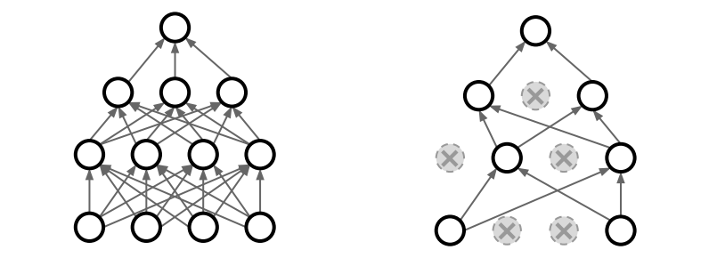

# Dropout

Overfitting(과적합) 문제를 해결하기 위한 방안을 앞에서 여러 가지 살펴보았다. 이번에 살펴볼 __Dropout__ 도 다층 신경망의 과적합 방지를 위한 기법 중 하나이다. 

Dropout은 2014년, Srivastava 박사 외 연구팀이 제안한 방법으로, 간단하게 이해할 수 있지만 무척 강력한 성능을 낸다.

방법은 단순하다. 뉴럴 네트워크의 한 레이어에서 다음 레이어로 넘어가는 출력 중 일부를 랜덤하게 탈락시키는 것이다. 그림으로 보면 아래와 같을 것이다.



이 단순한 방법이 어떻게 강력한 성능을 낼까?

신경망 모델이 Overfitting을 일으키는 이유 중 하나는 __가중치 매개변수(Parameter)가 너무 많아서__ 이다. 매개변수가 많을수록 레이어와 레이어 사이의 관계를 더 '깊고 자세하게' 연관짓는 결과를 낳고, 이는 곧 오버피팅을 의미한다. 따라서 레이어 사이의 연결 간선, 즉 매개변수를 줄이면 오버피팅이 일어날 가능성을 낮출 수 있다. 그리고 그 매개변수를 줄이는 방법이 바로 __Dropout__ 이 되는 것이다.

### Tensorflow에서 구현
다행히도 Tensorflow는 Dropout의 구현을 지원하고 있다. 함수 하나의 호출로 Dropout을 구현할 수 있다.

어떤 레이어의 출력이 다음과 같이 구현되었다면,

```
layer = tf.nn.relu(tf.matmul(X, W) + b)
```

다음과 같이 레이어의 출력에 Dropout을 먹이고, 그것을 다음 레이어의 입력으로 넘겨주게 만들면 된다.

```
dropout_rate = tf.placeholder(tf.float32)

_lyr = tf.nn.relu(tf.matmul(X, W) + b)
layer = tf.nn.dropout(_lyr, dropout_rate)
```

`dropout_rate`는 탈락시키지 않고 다음 레이어로 넘길 매개변수의 비율을 말한다. 0부터 1까지 허용되며, 예를 들어 0.7이면 70%만 살리고 30%는 랜덤하게 탈락시키겠다는 이야기다. 또 `dropout_rate`도 tf.placeholder 객체이므로, 학습을 시킬때 feed_dict 딕셔너리에 dropout_rate 실수를 포함시켜주어야 한다.

### Conclusion
Dropout은 정말 획기적인 알고리즘이다. 하지만 만드는 모델에 따라서 Dropout이 약이 될 수도, 독이 될 수도 있는 것 같다. 자신이 개발하는 모델의 특성에 맞춰서 Overfitting 방지책을 설계하는 것이 중요할 것 같다.