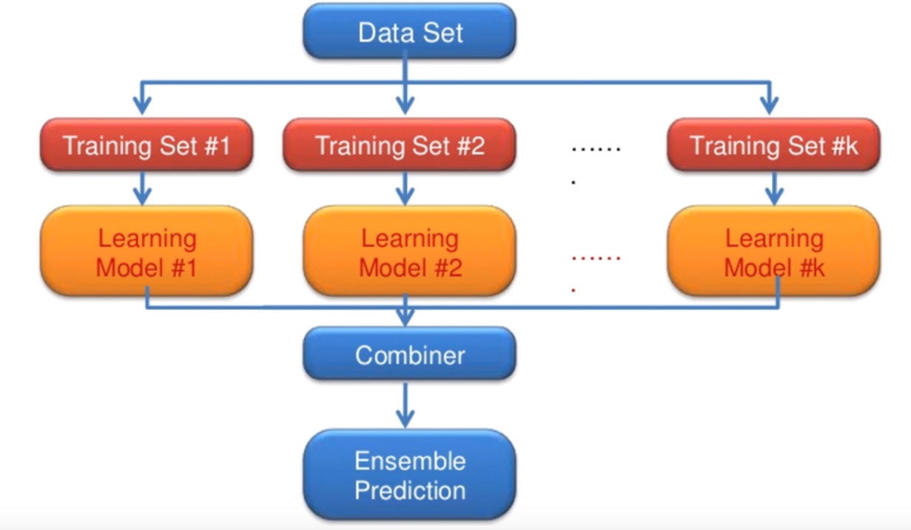

# 모델 앙상블 (Model Ensembles)
이번에는, Overfitting을 줄이는 방법임과 동시에 효과적인 신경망의 학습을 돕는 기술인 __모델 앙상블 (Model Ensemble)__ 에 대해서 알아보자.

앙상블 기법을 설명하자면 간단하다.

- 여러 개의 __독립된 모델__ 을 학습시켜서
- 그 모델들의 학습 결과를 병합하자.

사진으로 보면 다음과 같을 것이다.

여러 개의 독립된 네트워크 모델을 만들어서 각각 따로 학습시킨 후, 특정한 방법을 이용하여 결과를 병합하고 그것을 이용해 Prediction을 수행한다. 병합의 방법은 구현하는 모델에 따라 알맞게 구현해주면 된다.

앙상블 기법을 사용하면 적어도 2%의 성능 향상을 기대할 수 있다고 한다. 하지만 이것도 모델에 따라 다를테니, 적절히 상황에 맞춰 구현해주는 것이 필요할 것 같다.