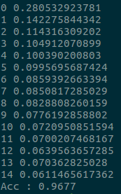
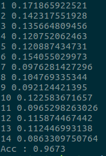
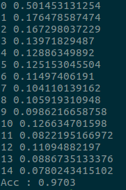
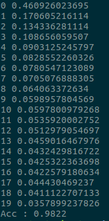

# MNIST Challenge
지금까지 공부한 기술들을 활용해서, MNIST 분류의 정확도를 최대한 높이는 Challenge를 진행해 보자.

매개변수 초기화에 Xavier Initializer를 사용하고, Dropout 기법을 사용해서 학습시키며, 최적화 알고리즘으로는 Adam Optimizer를 사용해 보자.

먼저, Xavier Initializer의 Tensorflow에서 구현법부터 알아보자. 가중치 변수를 초기화할 때, 다음과 같이 초기화해주면 된다.
```
W = tf.get_variable("W", shape=[784, 256], initializer=tf.contrib.layers.xavier_initializer())
```
정말 간단하게 사용 가능하다. 첫번째 인자로 넘어가는 문자열은 Tensorflow Graph상의 이름이다.

그리고 이번 구현에서, 모델을 Python Class의 형태로 묶어보기로 했다. 이는 실제로 유지 보수 측면에서나, 나중에 Ensemble 등의 기법을 적용하기 위해서나 좋은 구현 방향이다.

### 1차 구현 : Xavier Initializer, Adam Optimizer
첫번째 구현은, Xavier Initializer를 가중치 초기화 과정에서 적용한 구현이다. 총 3개의 레이어로 이루어진 모델이며, 가중치의 모양은 순서대로 (784 x 256), (256 x 256), (256 x 10)이다.

Adam Optimizer의 학습률로는 0.01을 사용하였으며, 전체 세트 학습을 15 epoch 수행한다.

결과는 다음과 같다.



간단한 초기화 방법의 변화로 96.77%의 정확도면 나쁘지 않은 것 같다. 무엇보다 인상적이었던건, 가중치의 효과적인 초기화로 인해 cost 함수가 처음부터 매우 낮은 점에서 시작했다는 것이다.

### 2차 구현 : Hidden Layer의 추가
두번째로, Hidden Layer를 두 층 더 추가해서 5층의 신경망으로 모델을 구성했다. 그리고 학습률을 0.001로 더욱 낮췄다. 더욱 깊은 모델을 구성하면, 아마 더 낮은 최적값에 도달하지 않을까 싶다. 결과는 다음과 같았다.



96.73%로 오히려 살짝 낮아진 결과를 보였다. 학습 초반에는 잠깐 더 빠르게 수렴하는 모습을 보여주다가, 1차 구현과 금방 비슷해졌다.

### 3차 구현 : 더욱 넓은 네트워크의 구성
그러면 이번에는 깊게만 가지 말고, 방금의 5층 네트워크를 더 넓게 만들어보자는 생각이 들었다. 히든 레이어들은 지금까지 256개의 퍼셉트론을 가지고 있었는데, 512개로 확장해보자. 가중치의 모양들은 (784 x 512), (512 x 512), (512 x 512), (512 x 512), (512 x 10)이 될 것이다. 결과는 다음과 같았다.



학습 초반에는 훨씬 멀리 떨어져 보였으나, 결국 더 낮은 최적값으로 수렴했다. 97.03%의 정확도를 기록했다. 확실히 적당히 깊으면서 넓은 네트워크를 구성하는 것이 중요해 보인다.

그리고 신경망의 크기가 갑자기 커지다 보니, 학습에 걸리는 시간도 크게 늘어났다. 슬슬 GPU의 필요성이 보이기 시작한다.

### 4차 구현 : Dropout
마지막으로 Dropout 기법을 실제로 적용해 보기로 했다. 4개의 레이어에서 각각 70%의 생존률을 이용해 Dropout을 구현했다. 그리고 Training Epoch을 총 20회로 5회 늘렸다. 결과는 다음과 같았다.



무려 98.22%의 정확도로, 획기적인 성능 향상을 불러왔다. Dropout이 실제로 효과 있는 기법임을 증명할 수 있었다.

### 구현 코드
구현 코드는 이 레포지토리의 [이곳](https://github.com/MagmaTart/DeepLearningStudy/blob/master/Soomin/codes/mnist_NN_challenge.py)에 따로 저장해 놓았다.