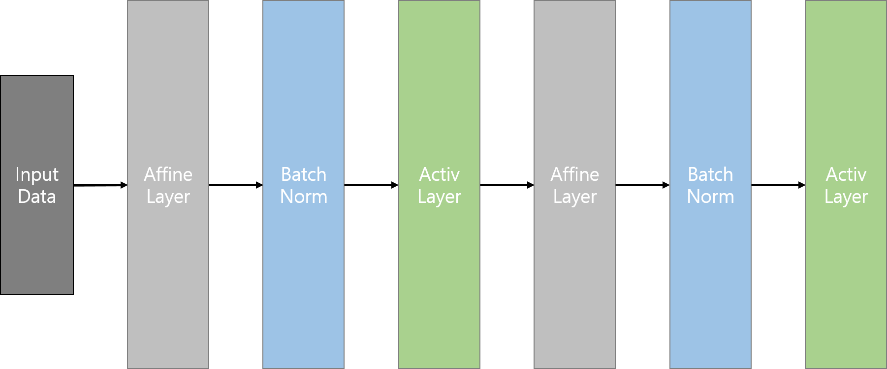

# 배치 정규화 (Batch Normalization)
앞에서 가중치의 적절한 초기화 방법을 사용하여, 각 층의 활성화 값 분포를 적절히 퍼지게 하면서 학습이 잘 일어나게 구현했다. 이번 글에서 살펴볼 배치 정규화는, 간단히 말해서 활성화 값이 적당히 퍼지도록 __강제__ 하는 방법이라고 볼 수 있다.

배치 정규화는 2015년도에 제안된 방법이다. 배치 정규화가 주목받는 이유는 다음과 같다고 한다.
- 학습을 빨리 진행할 수 있다.
- 학습이 가중치의 초깃값에 크게 의존하지 않는다.
- 오버피팅을 억제하는 효과가 있다.

실제로 앞에서 살펴보았던 대부분의 문제들을 해결할 수 있는 엄청난 방법이라고 할 수 있을 것 같다.

### 배치 정규화의 모양
배치 정규화의 구현은, __배치 정규화 계층__ 을 네트워크의 중간에 삽입함으로써 구현된다. 그림으로는 다음과 같다.



학습 시 Mini-Batch를 단위로 위의 배치 정규화를 수행한다. 데이터 분포가 평균이 0, 분산이 1이 되도록 정규화힌다. 수식으로 보면 다음과 같다.

1. 


2. 


3. 
 
순서대로 살펴보자. 1번 식은 입력 데이터들의 평균을 구해서 에 대입한다. 2번 식은 편차의 제곱의 평균, 즉 입력 데이터의 분산을 구한다. 세번째 식은 위에서 구한 평균과 분산을 바탕으로, 각 데이터에 대해 (편차)/(표준편차)를 계산하여 정규화된 데이터를 생성한다.

이렇게 데이터를 생성하면, 데이터는 평균이 0, 분산이 1이 되게 정규화된다. 정확히 1은 아니어도 1에 매우 가까워진다.

하지만 이렇게 생성된 데이터를 그대로 사용할 수는 없다. 위의 과정을 거쳐 만들어진 평균 0, 분산 1의 데이터를 활성화 함수에 넣으면, __활성화 함수의 비선형성__ 이 사라질 수 있기 때문이다. [이 글](https://shuuki4.wordpress.com/2016/01/13/batch-normalization-%EC%84%A4%EB%AA%85-%EB%B0%8F-%EA%B5%AC%ED%98%84/amp/)의 내용을 인용하자면, sigmoid 활성화 함수에 저 데이터를 넣을 경우 출력은 곡선보다는 직선의 형태에 가까울 것이다. 또 네트워크의 수치적 데이터 분포가 한정되기 때문에, 네트워크가 표현할 수 있는 특징이 제한될 수 있다. 따라서 __Scale(확대)__ 과 __Shift(이동)__ 작업을 수행하여 활성화 함수의 입력으로 적합한 데이터로 만들어 준다. 확대와 이동 변환을 수식으로 표현하면 다음과 같다.


이 식에서 의 계수 가 데이터 분포의 확대, 가 이동을 수행한다. Scaling과 Shifting을 통해서 활성화 함수에 적합한 형태로 데이터가 변하게 되고, 학습을 더 정확하게 수행하게 된다. 그리고 와  또한 학습 과정에서 역전파를 통해 업데이트 과정을 거친다. 두 변수의 초깃값은 로 시작한다.

### 배치 정규화 구현
직접 numpy를 이용해서 구현해보자. 데이터는 임의로 간단하게 생성하였다. 코드는 아래와 같다.
```
import numpy as np

X = np.arange(1, 21, 1)
print('X :', X)

avg = np.mean(X)               # 평균
xhat = (X - avg) / np.std(X)   # 정규화
print('Normalized data')
print(xhat)

print('Normed`s mean :', np.mean(xhat))
print('Normed`s variance :', np.var(xhat))
```

결과는 다음과 같다.

```
X : [ 1  2  3  4  5  6  7  8  9 10 11 12 13 14 15 16 17 18 19 20]
Normalized data
[-1.64750894 -1.47408695 -1.30066495 -1.12724296 -0.95382097 -0.78039897
 -0.60697698 -0.43355498 -0.26013299 -0.086711    0.086711    0.26013299
  0.43355498  0.60697698  0.78039897  0.95382097  1.12724296  1.30066495
  1.47408695  1.64750894]
Normed`s mean : 0.0
Normed`s variance : 1.0
```

원하던 대로, 입력 데이터가 평균 0, 분산 1이 되는 데이터로 정규화된 것을 볼 수 있었다.

Scaling과 Shifting을 포함한 신경망에서의 구현은 실제 실습을 진행하면서 코드에 포함시키도록 하겠다.
