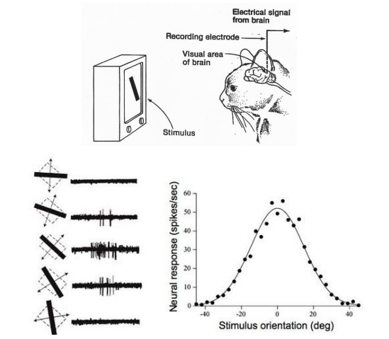
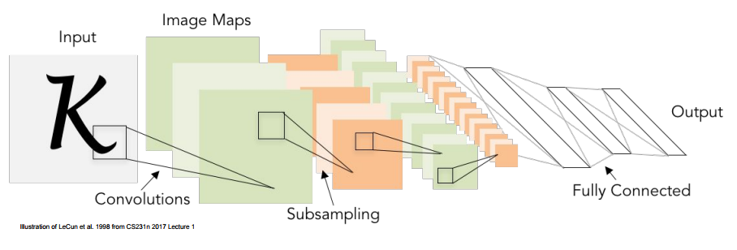
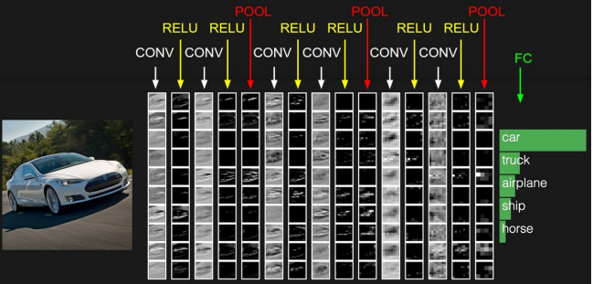

# CNN : 개념
이제부터는, 실제로 쓰이는 딥 러닝 모델들을 알아보자. 첫 번째로 CNN (Convolutional Neural Network)에 대해 알아보자.

CNN은 Vision 분야의 큰 발전을 가져오고 있는 대단한 모델이다. 시작은 고양이가 물체를 볼 때, 뇌에서 인식하기까지의 과정을 모방한 모델이라고 한다.

단순히 이야기하자면, 전체 이미지를 한 번에 보는게 아니라 작은 이미지를 확인한 결과들을 모아 전체 물체를 인식한다는 것이다. 이를 신경망으로 비슷하게 구현한 모델의 모양이 다음과 같다.

Input 데이터를 일정한 모양과 간격으로 나눠서 __Convolution__ 이라는 연산을 진행하고, 그 출력을 __Subsampling__ 을 통해 크기를 줄이는 작업을 반복한다. 그 결과로 나온 작은 이미지를 1차원으로 변환해 __Fully-Connected Layer__ 를 만들어서 그 출력을 이용해 분류를 진행하게 된다. 그리고 이 모델이 바로 __CNN__ 이다.

CNN의 구조를 다시 자세히 보면 대략 다음과 같다.

입력 이미지가 들어오면, Convolution Layer와 Activation Layer를 여러 번 거친다. 이 때 Activation Function으로는 앞에서 말했듯이 ReLU를 많이 사용한다. 그 후 Pooling Layer를 거치는데, 이 과정에서 이미지의 크기가 작아지게 된다. 처음 입력과 같은 큰 데이터를 Fully Connected Layer에 밀어넣는 것은 좋지 않기 때문에, 특징을 추출하면서 이미지의 크기를 줄이는 방법으로 위와 같은 방법을 사용한다. 그 후 같은 과정을 여러 번 더 거쳐서 이미지의 크기를 더욱 줄인 후, Fully Connected Layer에 그 결과를 넣어서 분류를 수행하게 된다.

그럼 이름에도 들어가있듯이 CNN의 핵심인 __Convolution Layer__ 에 대해 알아야 할 것 같다. Convolution Layer는 한마디로, 특정한 필터를 사용해 __데이터의 특징을 추출__ 하는 레이어로 볼 수 있다. 그리고 그 특징을 추출하는 과정에서 필터가 입력 이미지에 수행하는 연산을 __Convolution(합성곱)__ 연산이라고 한다. 그리고 CNN의 목적은, 이 __필터를 업데이트__ 하여 특징을 더욱 부각시키도록 만들면서, 특징이 부각된 데이터로 분류를 수행하는 것이라고 볼 수 있다. 나중에 시간이 되면 수학적인 의미의 합성곱에 대해서도 포스팅을 해야겠다.

__Activation Layer__ 가 진짜로 이미지의 특징을 추출해내는 역할을 한다. Convolution Layer에서 필터를 거친 이미지가 들어오면,활성화 함수를 이용해서 살려 놓을 특징을 정하고  결과적으로 특징이 더 부각된 데이터를 출력한다. 보통 CNN에서는 활성화 함수로 ReLU를 사용한다고 한다.

__Pooling Layer__ 는 대놓고 이미지의 크기를 줄이기 위한 레이어다. Convolution Layer에서도 이미지의 크기가 약간씩 줄어들기는 하지만, 특정한 방법을 이용해 Padding, 즉 줄어든 공간을 채우며 Convolution을 진행하므로 실질적인 데이터 크기 감소는 Pooling Layer가 진행하게 된다.

정리하자면, CNN은 __이미지의 특징을 추출__ 하여 __입력 데이터__ 를 __특징이 강조된 작은 데이터__ 로 만들어 분류하는 신경망 모델이다. 그리고 이런 특성은 CNN이 Computer Vision 분야에서 큰 성과를 내는 이유가 되었다.

실제로 각각 레이어들이 어떻게 동작하는지는 다음 글에서 살펴보자.