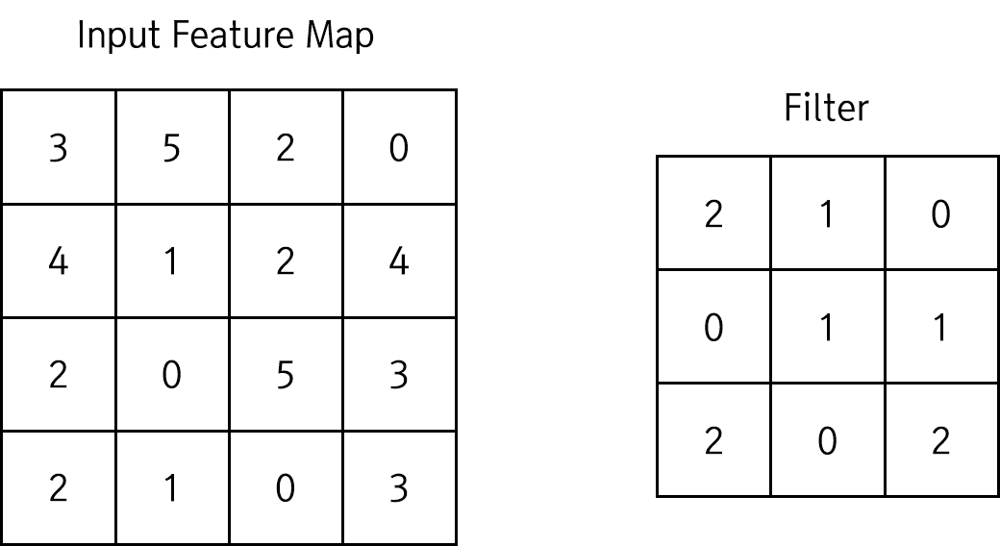

# CNN : Convolution Layer
CNN의 핵심인 Convolution Layer에 대해 알아보자.

### Convolution Layer
지금까지 NN을 구성하면서 사용하던 일반 Affine 계층의 문제점은, 입력의 특징이 사라진다는 점이다. 일반 Affine 계층은 입력이 1차원으로 평탄화된 데이터이다. 따라서 입력으로 3차원의 데이터가 들어오든 4차원이 들어오든, 모두 1차원으로 평탄화해서 입력하게 된다. 예를 들어, MNIST 데이터를 NN으로 구현했을 때 (1 x 28 x 28) 모양 데이터를 (784) 모양으로 펴서 구현했었다 [(참고)](https://github.com/MagmaTart/DeepLearningStudy/blob/master/Soomin/summarys/16_MNISTusingSimpleNN.md). 

MNIST 데이터는 전처리가 매우 이쁘게 잘 된 데이터세트이기 때문에, 1차원으로 펴서 입력한 후 SOFTMAX 분류를 수행해도 정확도가 매우 높게 잘 나오는 것을 볼 수 있었다. 하지만 현실의 일반 이미지 데이터세트는 그리 이쁘지 않다. 크기도 매우 크고, 이미지가 회색조가 아닌 RGB 컬러인 경우가 많기 때문에 1차원으로 평탄화하기에 너무 큰 경우가 대부분이다. 이런 데이터를 강제로 펴서 SOFTMAX 분류를 수행할 경우 정확히 분류되지 않을 가능성이 매우 높다.

따라서 이런 경우, 특히 이미지 데이터를 이용할 경우에는 다른 방법이 필요하다. 이미지에는 보통 고유한 공간적 정보가 담겨 있다. 인접한 픽셀의 색깔이 비슷하다거나, 거리가 먼 픽셀끼리는 큰 관련이 없는 등의 정보가 담겨 있다. 그리고 이는 그 데이터의 고유한 __특징__ 으로 볼 수 있다. 따라서 이런 이미지를 신경망에 이용하려면 이미지의 형태를 되도록이면 __그대로 유지__ 하는 처리 방법이 필요하다. 이미지를 1차원으로 평탄화하면, 위에서 말했던 고유한 특징들을 알아볼 수 없게 되기 때문이다. 따라서 3차원 데이터상에서만 유지할 수 있는 특징, 즉 패턴들을 유지하기 위한 방법이 필요하다.

이를 해결하기 위한 방법이 __Convolution Layer__ 의 사용이다. Convolution Layer는 한글로 __합성곱 계층__ 이라고도 한다. 이 레이어는 입력 데이터도 3차원 데이터로 입력받고, 다음 계층에 전달할 출력도 3차원 데이터로 출력한다. 그래서 CNN이 이미지와 같은 데이터를 제대로 이해할 가능성이 높은 것이다.

CNN에서는 입출력 데이터를 __특징 맵(Feature Map)__ 이라고도 한다. 입력 데이터를 __입력 특징 맵(Input Feature Map)__ , 출력 데이터를 __출력 특징 맵(Output Feature Map)__ 이라고 한다.

### 합성곱 연산 (Convolution)
Convolution Layer의 핵심인 __합성곱(Convolution)__ 에 대해 알아보자. 합성곱 연산은 일종의 __필터 연산__ 과 비슷하다. 입력 데이터의 이미지에 특정 크기의 필터를 적용하여 새로운 이미지를 생성해낸다. 필터는 __커널(Kernel)__ 이라고 부르기도 한다.

아래와 같은 입력 데이터에 아래와 같은 필터를 적용하여 합성곱 연산을 진행해보자.

위와 같은 Input Feature Map에 위와 같은 Filter를 적용한다. 필터 연산은 다음과 같이 필터 크기에 맞춰서 Input Feature Map을 나눠 진행한다.

그리고 같은 위치에 있는 픽셀끼리 곱한다. 예를 들어 아래의 그림에서, 같은 색의 픽셀끼리 곱셈을 수행하게 된다.

그리고 그 곱셈을 누산하여 하나의 값을 만들어 낸다. 위의 Convolution 연산 결과는 다음과 같을 것이다.

필터와 같은 크기의 범위 내에 합성곱 연산을 적용해서 하나의 값을 추출해 낸다. 그리고 입력 데이터에서 일정 거리만큼 계속 필터를 이동하면서 계속 Convolution 연산을 수행해서, 새로운 Output Feature Map을 만들어낸다. 이 때 아래와 같이 모든 입력 데이터가 연산에 참여할 수 있도록 한다. 그 결과 Convolution이 4번 수행되고, 4개의 값이 위치에 따라 추출되어 아래처럼 새로운 Feature Map이 만들어진다.

그리고 Convolution Layer에도 당연히 Bias가 참여한다. 다음과 같이 Bias 덧셈 연산이 이루어진다.

이렇게 합성곱 연산이 완료되고, 이것이 CNN의 핵심인 Convolution Layer의 구현이다.

### Stride와 출력 특징 맵의 크기
Convolution 연산을 진행하는 과정에서, Filter가 한번 이동하는 거리를 Stride라고 한다. 위의 예제에서는 Filter가 Stride=1로 움직였다. 입력 이미지와 필터의 크기, Stride를 결정하면 출력 크기를 구할 수 있다.  크기 이미지에  크기 필터를 의 스트라이드로 움직일 때, 출력 채널의 크기 는 다음과 같다.

예를 들어, MNIST의 입력 이미지는 (28 x 28)이다. 이 이미지에 (3 x 3) 크기 필터를 1의 Stride로 적용하면, 출력 이미지의 크기를 (C x C), 즉 (26 x 26)이다.