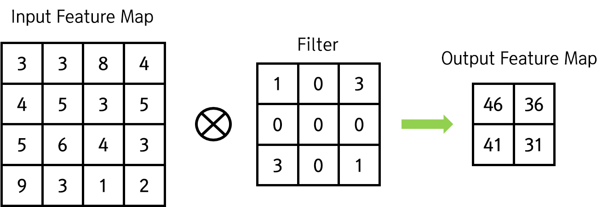
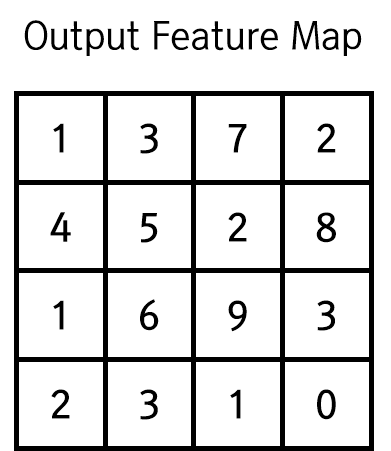
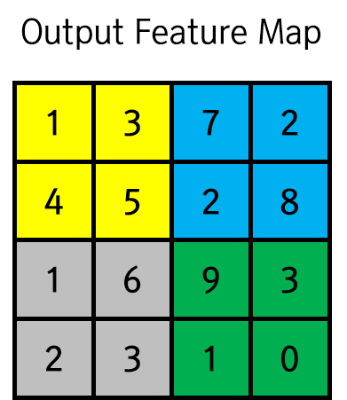
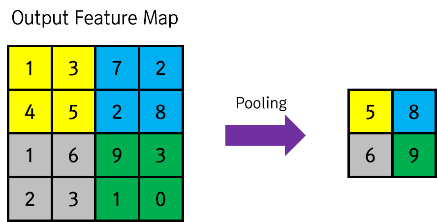

# CNN : Zero Padding, Pooling Layer
이번 글에서는 Convolution Layer에서 이미지의 크기를 유지하기 위한 기법인 __Zero Padding__ 기법과, CNN의 두 번째 핵심인 __Pooling Layer__ 에 대해 알아보자.

### Zero Padding
컨볼루션 레이어를 거치면 이미지의 크기가 줄어든다. 이미지의 특징을 추출해야 하는 컨볼루션 레이어의 특성 상 연산 후 이미지의 크기가 줄어드는 것은 좋지 않다. 따라서 이미지의 컨볼루션 레이어를 거친 후에도 이미지의 크기를 유지하는 방법이 필요한데, 대표적인 방법이 __Zero Padding__ 기법이다. 간단히, 줄어든 이미지의 크기만큼 0으로 출력 특징 맵을 감싸는 것이다.

예를 들어 다음과 같은 컨볼루션 연산이 진행되었다고 하자.

출력 특징 맵에 Zero Padding을 적용하면, 다음과 같은 이미지가 출력된다. 다음 레이어에는 이 이미지가 입력되게 된다.

### Pooling Layer

Pooling Layer는 __이미지의 크기를 줄이는__ 작업을 하는 레이어이다. 레이어 간에서 이미지의 크기를 줄이기 위해 사용하는 레이어가 Pooling Layer이다. 이미지에 대해서 컨볼루션 연산을 먼저 수행하여 특징을 추출해 낸 다음에, 풀링 레이어를 거쳐서 이미지의 크기를 줄이고 특징을 부각하게 된다. 이렇게 이미지의 크기가 줄면서 마지막 Fully-Connected Layer에서 학습하기 용이한 크기의 특징이 부각된 이미지가 만들어지게 된다.

사실 앞에서 보았듯이 컨볼루션 레이어에서도 이미지의 크기가 줄어들기는 한다. 먼저 알아보았지만, 컨볼루션 과정에서는 이미지의 크기를 __Zero Padding__  등의 패딩 기법을 사용하여 유지한다. 따라서 본격적으로 이미지의 크기를 줄이는 레이어는 이 풀링 레이어가 되는 것이다.

가장 많이 사용하는 풀링 레이어는 (2x2) 크기에 Stride 2로 움직이는 풀링 레이어라고 한다. 풀링의 방법에도 여러 가지가 있는데, __Max Pooling, Average Pooling, L2-norm Pooling__ 등 여러 가지 방법이 존재한다. 원래는 Average Pooling 기법이 많이 사용되었으나, 요즘은 Max Pooling이 그 성능을 인정받고 있다. Max Pooling은 해당 공간 내에서 가장 큰 값을 선택하는 풀링 기법이다.

그럼 Max Pooling의 간단한 예시를 통해 알아보자. 아래는 어떤 컨볼루션 레이어를 거치고 나온 데이터의 모양이다.

이 출력 특징 맵에 (2x2) 크기의 Stride 2 Max pooling을 적용한다. 그럼 다음의 그림에서 같은 색을 가지고 있는 부분끼리 각각 Max Pooling을 진행하여 결과를 하나의 Map으로 합치게 된다.

그럼 출력은 다음과 같을 것이다.

Average Pooling은 해당 공간 내 값들의 평균을 풀링 값으로 취하는 방식이고, L2-norm Pooling은 해당 범위 내의 값들에 대해 L2-norm을 구하여 풀링 값으로 취하는 방식이다. L2-norm은 각 원소의 제곱의 합에 루트를 씌우는 연산이라고 생각하면 된다.
