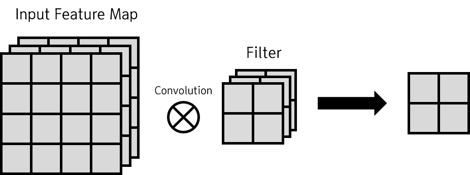
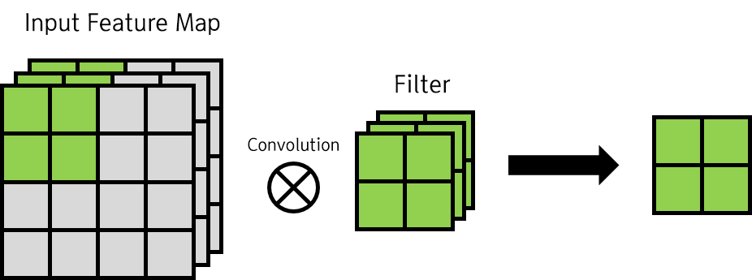
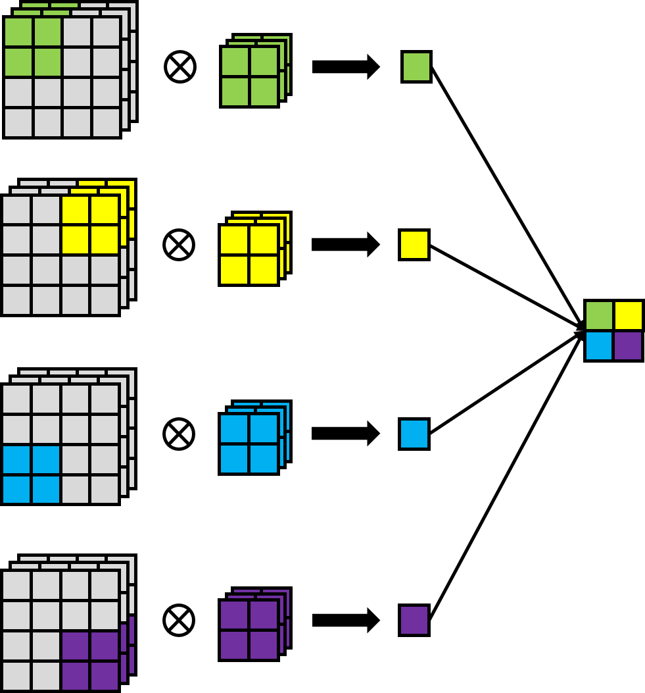
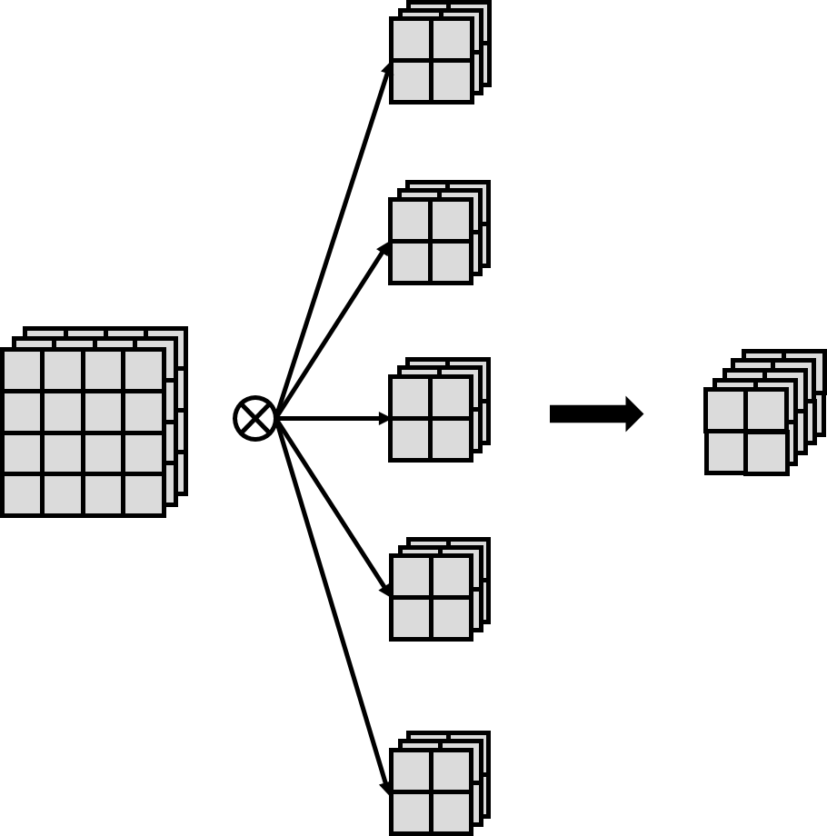

# CNN : Convolution Layer 2
### 출력 특징 맵 크기 계산
[이전 글](https://github.com/MagmaTart/DeepLearningStudy/blob/master/Soomin/summarys/27_CNN2.md)에서 출력 특징 맵의 크기를 계산하는 방법을 간단하게 알아보았다. 이제 그 식을 조금 더 구체화하여, 출력 특징 맵의 크기를 계산하는 연습을 해보자.

기본적으로 컨볼루션 연산에서 스트라이드를 키우면 출력 크기는 작아지고, 패딩을 크게 하면 출력 크기가 커진다. 이 관계를 수식화해보자. 입력 특징 맵의 크기를 ), 필터의 크기를 ), 패딩의 크기를 , 스트라이드를 라고 하면, 출력 특징 맵의 크기 )는 다음과 같이 계산할 수 있다.

이 식을 사용하여, 실제로 계산을 수행해보자. 입력 특징 맵의 크기가 (4, 4)이고, 패딩의 크기가 1, 스트라이드가 2, 필터의 크기가 (2,2)일 때, 출력 특징 맵의 크기 )는

이다. 이 계산이 맞는지, 직접 그림으로 확인해보자.

컨볼루션 레이어를 구성하기 전에, 미리 이 식을 이용해서 출력 특징 맵의 크기를 계산해보아야 한다. 가장 큰 이유는, 지정한 크기와 스트라이드, 패딩으로 움직였을 때 생성되는 출력 특징 맵의 크기가 정수로 떨어지지 않는 상황을 방지하기 위해서이다. 물론 최근의 딥러닝 라이브러리들은 실수를 정수로 만들어주는 처리를 해 주기도 한다.

### 3차원 데이터의 컨벌루션 연산
지금까지 다루었던 컨벌루션 연산은 2차원 데이터였다. 하지만 CNN이 가장 자주 쓰이는 주제인 이미지만 하더라도, RGB 세 개의 채널이 병합되어 있다. 이를 입력 데이터로 사용할 때는 3차원 데이터로 사용될 것이다. 따라서 컨벌루션 연산을 3차원 상에서 진행해야 한다.

3차원 데이터는 2차원 특징 맵을 여러 장 겹쳐놓은 것으로 볼 수 있다. 아래와 같은 컨벌루션 연산을 진행한다고 하자.

이미지의 일부와 필터가 수행하는 한 번의 컨벌루션 연산은 다음 그림과 같다.

3차원 데이터에서의 높이, 즉 포함된 2차원 데이터의 수를 __채널__ 이라고 한다. 3차원 컨벌루션 연산에서 주의할 점은, 입력 데이터의 채널 수와 필터의 채널 수가 같아야 한다는 것이다. 그래야만 컨벌루션의 결과들을 합쳐서 하나의 결과를 내놓을 수 있다. 필터 자체의 가로 세로 크기는 마음대로 정할 수 있으나, 모든 채널의 필터가 같은 크기여야 한다.

3차원 데이터에서의 컨벌루션 연산은 같은 채널의 입력 특징 맵과 필터를 각각 컨벌루션 한 후, 그 결과를 모두 더하는 방식으로 진행된다. 위 그림의 컨벌루션 연산을 스트라이드 2로 진행한다면, 다음과 같은 모습일 것이다.

보다시피, 연산의 출력이 다시 2차원 데이터가 되어 나오고 있다. 하지만 필터는 3차원 모양이기 때문에, 다음 컨벌루션 레이어로 출력 특징 맵을 넘겨주려면 컨벌루션 연산의 출력은 3차원이어야 한다.

3차원의 출력 특징 맵을 만드는 방법은, 3차원 모양 필터를 여러 개 써서 여러 개의 2차원 출력 특징 맵을 쌓아 3차원으로 만드는 것이다. 아래와 같이 말이다.

필터와 입력 특징 맵이 3차원이기 때문에, 편향도 당연히 3차원이다. 3차원 컨벌루션 연산의 결과에 3차원 모양의 편향을 더해서 편향 계산을 수행한다.

### 배치 처리
일반적인 신경망에서는 배치 처리, 데이터를 작은 단위로 나누어서 따로 한번에 처리하는 방법을 사용한다. CNN에서도 당연히 배치 처리를 구현한다. 3차원 입력 특징 맵 데이터를 여러 개 주면, 그 데이터들에 대해서 컨벌루션 연산 후 편향을 적용한 출력 특징 맵 데이터도 여러 개가 나오게 된다. 3차원 데이터가 여러 개 사용되므로 이는 4차원 데이터로 관리할 수 있을 것이다. 따라서 입력 데이터도 당연히 4차원이다. 

따라서 CNN에서 컨벌루션 레이어 사이를 흐르는 데이터의 모양은 4차원이다.