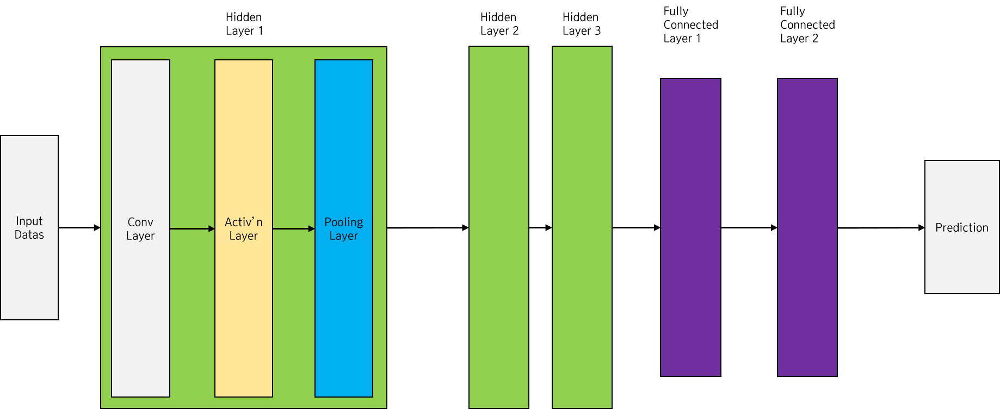
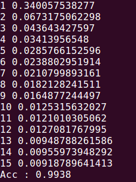

# CNN : MNIST 분류 구현
이제, 실제로 MNIST 분류를 CNN으로 구현하면서 CNN을 직접 구현해보자. 코드는 [김성훈 교수님의 강의 코드](https://github.com/hunkim/DeepLearningZeroToAll/blob/master/lab-11-2-mnist_deep_cnn.py)를 이용하였다.

먼저, 우리가 구현할 MNIST 분류 CNN 모델은 다음과 같은 모양이다.



컨벌루션 연산과 풀링 연산을 수행하는 히든 레이어를 3회 거친 후에, 그 데이터를 다시 쭉 펴서 SOFTMAX 분류를 위한 Fully-Connected Layer에 넣을 것이다. 그 SOFTMAX 연산의 결과를 이용하여 분류를 수행하게 된다.

먼저 MNIST 데이터를 불러 오자.

```
import tensorflow as tf
from tensorflow.examples.tutorials.mnist import input_data
tf.set_random_seed(9297)

mnist = input_data.read_data_sets("MNIST_data/", one_hot=True)
```

저번에 MNIST 분류를 구현했던 것과 같이, 배치 학습을 구현할 것이다. 학습에 사용되는 Hyper Parameter들을 정해 준다.

```
learning_rate = 0.001
training_epochs = 15
batch_size = 100
keep_prob = 0.7
```

학습률, 학습할 Epoch 수, 한번 꺼낼 batch size, Dropout에서 적용할 생존률을 정해 주었다.

이제 X 데이터를 가져와서, CNN 네트워크 안에 들어갈 수 있는 4차원 데이터 형태로 만들어준다. 그 과정에서 `tf.reshape()` 메소드를 활용한다. Y 데이터는 원래대로 가져온다. one-hot vector이기 때문에 상관없다.

```
X = tf.placeholder(tf.float32)
X_img = tf.reshape(X, [-1, 28, 28, 1])    # Make 4-dimensional image
Y = tf.placeholder(tf.float32)
```

28 * 28의 1차원 이미지인 MNIST 데이터를 (1 x 28 x 28) 크기의 4차원 데이터로 바꾸어주고 있다. 학습에 들어가는 모든 데이터는 저 형태로 네트워크에 입력된다.

이제 실제 신경망을 구현할 차례이다. 히든 레이어를 하나 구현하면, 나머지 레이어는 텐서의 크기를 제외하고 코드가 동일하므로 한 레이어의 모양을 자세히 살펴보자.

첫 번째 히든 레이어에서, 필터는 (3 x 3) 크기를 사용할 것이고, stride는 (1 x 1 x 1)로 움직일 것이다. 그리고 출력 데이터를 4차원으로 만들어주기 위해서 같은 크기의 필터를 32개 사용할 것이다. 필터를 그렇게 만들어준다.

```
W1 = tf.Variable(tf.random_normal([3, 3, 1, 32], stddev=0.01))          # 32 filters of [1, 3, 3]
```

이 필터를 이용하여 입력 X 데이터에 컨벌루션 연산을 진행한다. 컨벌루션 연산은 `tf.nn.conv2d()` 함수를 이용하여 진행한다.

```
Layer1 = tf.nn.conv2d(X_img, W1, strides=[1, 1, 1, 1], padding='SAME')  # Convolution with [1, 1] strides
```

4차원 형태로 만든 입력 데이터인 `X_img`와 필터를 (1 x 1 x 1)의 stride로 컨볼루션 연산을 진행한다. 그리고 padding을 진행하는데, 여기서는 우리가 직접 패딩의 크기를 정해주지 않고, Tensorflow에게 맡기고 있다. `padding='SAME'`은, 컨볼루션 연산의 출력이 그 이전과 모양이 동일하도록 패딩해달라고 요청한다. MNIST의 입력 데이터가 (28 x 28) 크기이므로, `padding='SAME'`을 적용하면 컨볼루션 연산 후 패딩을 씌운 출력 특징 맵의 크기도 (28 x 28)이 된다.

우리는 이걸 이용해 텐서플로우가 몇 크기의 패딩을 적용하고 있는지 계산할 수 있다. 패딩의 크기를 로 놓고, [이전 글](https://github.com/MagmaTart/DeepLearningStudy/blob/master/Soomin/summarys/29_CNN4.md)에서 알아보았던 출력 특징 맵 크기 계산 식에 집어넣어서 패딩의 크기를 구할 수 있다.

 이므로,  이다. 따라서 텐서플로우가 적용해주는 패딩의 크기는 1이라는 것을 알 수 있다.

그 후 활성화 함수로 ReLU를 적용해준다.

```
Layer1 = tf.nn.relu(Layer1)
```

그리고 이미지의 크기를 줄이기 위해, Max Pooling을 진행한다. 텐서플로우에서 Max Pooling은 `tf.nn.max_pool()` 함수를 이용해 수행할 수 있다.

```
# Max pooling with [2, 2] size and [2, 2] strides
Layer1 = tf.nn.max_pool(Layer1, ksize=[1, 2, 2, 1], strides=[1, 2, 2, 1], padding='SAME')
```

(2 x 2) 사이즈의 커널 크기로, (2 x 2) stride로 움직이면서 Max Pooling을 적용하고 있다. 따라서 풀링 후 출력 특징 맵의 크기는 (14 x 14)가 된다.

이렇게 매 레이어마다 출력 특징 맵의 모양을 기억해두어야 한다. 그래야 Fully Connected Layer의 모양을 정할 수 있기 때문이다.

풀링이 끝난 결과를 다음 히든 레이어에 입력하고, 그 결과를 다음 히든 레이어에 입력하고... 하면서 이미지의 크기는 줄여 나가고 갯수는 늘려 나간다. 그렇게 2번째 히든 레이어와 3번째 히든 레이어를 쌓아 보자.

```
W2 = tf.Variable(tf.random_normal([3, 3, 32, 64], stddev=0.01))         # 64 filters of [32, 3, 3]
Layer2 = tf.nn.conv2d(Layer1, W2, strides=[1, 1, 1, 1], padding='SAME')
Layer2 = tf.nn.relu(Layer2)
Layer2 = tf.nn.max_pool(Layer2, ksize=[1, 2, 2, 1], strides=[1, 2, 2, 1], padding='SAME')

W3 = tf.Variable(tf.random_normal([3, 3, 64, 128], stddev=0.01))        # 128 filters of [64, 3, 3]
Layer3 = tf.nn.conv2d(Layer2, W3, strides=[1, 1, 1, 1], padding='SAME')
Layer3 = tf.nn.relu(Layer3)
Layer3 = tf.nn.max_pool(Layer3, ksize=[1, 2, 2, 1], strides=[1, 2, 2, 1], padding='SAME')
```

첫 번째 히든 레이어가 32개의 필터를 사용하여 (32 x 3 x 3)의 출력을 내 놓았으므로, 두번째 히든 레이어에서는 (32, 3, 3) 크기의 필터를 적용해주어야 한다. 그리고 이번에는 출력을 64장으로 만들고 있다. 첫 번째 히든 레이어의 출력 특징 맵의 크기는 (64, 7, 7)이 된다.

세 번째 히든 레이어도 동일하다. (64, 3, 3) 크기의 필터를 적용해서 (128, 4, 4) 모양의 출력 특징 맵을 생성하고 있다.

그리고 세 번째 히든 레이어의 출력 특징 맵은 1차원으로 펴져서 Fully-Connected Layer에 들어가게 된다. 1차원으로 펴는 작업도 `tf.reshape()` 함수를 이용한다.

```
Layer3_flat = tf.reshape(Layer3, [-1, 4 * 4 * 128])    # flat the output feature map to [1,  4 * 4 * 128] size
```

(128, 4, 4) 모양의 출력 특징 맵을 1차원으로 펴주었다. 그리고 이것을 그대로 Fully-Connected Layer에 넣어주게 된다. 다음과 같이 말이다.

```
W4 = tf.get_variable("W4", shape=[4*4*128, 625], initializer=tf.contrib.layers.xavier_initializer())   # Fully Connected Layer
b4 = tf.Variable(tf.random_normal([625]))
Layer4 = tf.matmul(Layer3_flat, W4) + b4
Layer4 = tf.nn.relu(Layer4)
Layer4 = tf.nn.dropout(Layer4, keep_prob=keep_prob)
```

Xavier Initializer를 사용해서 Weight를 생성해주고, 출력의 크기가 줄어든 만큼 bias를 설정하고 있다. 연산은 일반 Affine 계층처럼 구현한 후, ReLU 활성화 함수와 Dropout을 적용해주고 있다. Fully-Connected Layer에서 Overfitting이 가장 잘 일어나므로, 여기에서 사용된 Dropout은 꽤나 효과적일 것으로 기대된다. `keep_prob`의 값은 0.7으로 앞에서 설정해준 바 있다.

그리고 2번째 Fully-Connected Layer에서 드디어 10개의 출력 벡터를 만들어낸다.

```
W5 = tf.get_variable("W5", shape=[625, 10], initializer=tf.contrib.layers.xavier_initializer())    # Fully Connected Layer
b5 = tf.Variable(tf.random_normal([10]))

logits = tf.matmul(Layer4, W5) + b5    # Logits function
```

10의 길이를 가진 출력 벡터를 만들고, 가설 함수를 만들어주었다. 이제 이 가설을 이용하여 cost 함수를 정의하고 AdamOptimizer를 이용하여 트레이닝만 돌리면 된다.

```
cost = tf.reduce_mean(tf.nn.softmax_cross_entropy_with_logits(logits=logits, labels=Y))    # Softmax cost
trainer = tf.train.AdamOptimizer(0.001).minimize(cost)    # Use Adam optimizer
```

이 글에서는 모델의 모양과 CNN의 구현법에 중점을 두었으므로, 실제 학습하는 부분은 적어놓지 않겠다. 그 대신 코드를 [이 곳]()에 공유하겠다.

정확도는 99.38%로 오류율이 드디어 1% 이하로 떨어진 것을 볼 수 있었다. CNN이 이미지의 특성을 이해하는 성질을 가지고 있기 때문에 이정도 정확도가 나온 것 같다.


