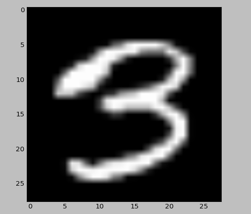

# MNIST 데이터셋

MNIST는 간단히 말해, 손글씨로 쓴 숫자 데이터세트이다. 0부터 9까지의 손글씨 숫자 데이터가 60,000장 있으며, 테스트용 데이터가 10,000장 있다. MNIST의 데이터는  크기의 Gray Scale 이미지이며, 각 픽셀은 0~255 사이의 값을 가진다. 또 각 이미지에는 그 숫자를 의미하는 레이블이 붙어 있다.

그럼 이 데이터를 실제로 찍어 보자. 데이터셋은 책의 도움을 받았다.

```
import numpy as np
import matplotlib.pyplot as plt
from mnist import load_mnist

(trainX, trainY), (testX, testY) = load_mnist(flatten=True, normalize=False)

print(trainX.shape)
print(trainY.shape)
print(testX.shape)
print(testY.shape)
```

책에서 미리 제공해 준 mnist 데이터 다운로드 모듈을 사용해서 모양을 찍어 보았다. 결과는 다음과 같다.
```
(60000, 784)
(60000,)
(10000, 784)
(10000,)
```
28 x 28 = 784이므로, 이미지가 정확히 60,000개와 10,000개가 있는 것을 알 수 있다.
이 중 하나를 직접 그려 보자.

flatten 인자를 False로 줘서 1차원 배열으로 펴지지 않게 하고, 배열을 reshape하여 차원을 줄였다.

```
(trainX, trainY), (testX, testY) = load_mnist(flatten=False, normalize=False)

trainX = np.reshape(trainX, (len(trainX), 28, 28))
print(trainX[0].shape)

plt.imshow(trainX[np.random.randint(60000)], 'gray')
plt.show()
```

60,000 개의 학습 데이터 중 랜덤하게 하나의 데이터를 아래처럼 그림으로 보여준다.


이 데이터셋을 이용하여 신경망을 만들면, 입력이 784개이고 출력이 10개인 신경망으로 만들 수 있을 것이다.
그리고 Softmax 함수를 사용하여 숫자 분류를 수행할 수 있을 것이다.