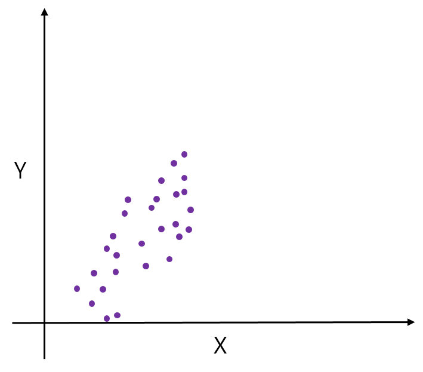
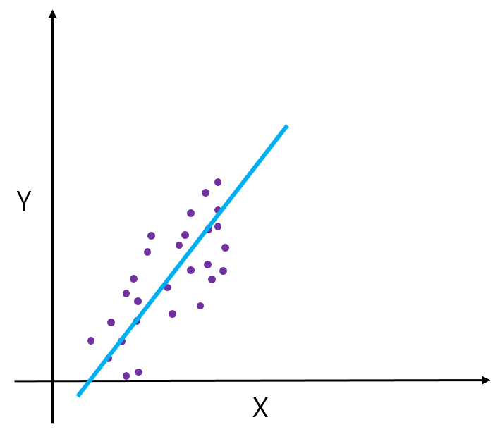

# Linear Regression

선형 회귀(Linear Regression)은, 주어진 데이터 사이에서, 그것들의 분포와 가장 가까운 직선을 찾는 방법이다.

X 데이터와 Y 데이터가 아래와 같은 분포를 가지고 있는 데이터셋이 있다고 하자.



이 데이터들과 같은 규칙으로 분포된 새로운 X 데이터가 있을 때, 다음의 파란 직선에 맞추어 Y 값을 예측할 수 있을 것이다.



이 파란 직선과 같은 선형 함수를 찾는 것이 선형 회귀법이다.

선형 회귀법을 구현할 때, 손실 함수로는 보통 __평균 제곱 오차__ 를 이용한다.

실제 선형 회귀 알고리즘을, Tensorflow를 이용하여 구현해보자.

입력이 1 모양이고, 출력도 1 모양이므로, Weight는 1 모양이고 BIas도 1모양이다. 이를 `tf.random_normal()` 함수를 이용해 만들어 준다. 그 후 출력 퍼셉트론의 연산 내용인 가설 함수를 정의해 준다. 활성화 함수로는 항등 함수를 사용하고, 평균 제곱 오차를 사용하여 손실 함수를 정의해 준다. 그리고 경사 하강법을 사용하여 손실을 최소화하며 Weight값과 Bias값을 찾는다.

```
import tensorflow as tf
import numpy as np

tf.set_random_seed(9297)

dataX = [1, 2, 3, 4, 5, 6, 7, 8, 9, 10]
dataY = [2, 4, 6, 8, 10, 12, 14, 16, 18, 20]

X = tf.placeholder(tf.float32)
Y = tf.placeholder(tf.float32)

Wwight = tf.Variable(tf.random_normal([1]))		# Weight : 1 크기
bias = tf.Variable(tf.random_normal([1]))		# Bias : 1 크기

logits = Weight*X+bias		# 가설 함수
cost = tf.reduce_mean(tf.square(logits-Y))		# 손실 함수

trainer = tf.train.GradientDescentOptimizer(learning_rate=0.01).minimize(cost)		# 경사하강법 사용

with tf.Session() as sess:
    sess.run(tf.global_variables_initializer())

    for step in range(1001):
        cost_v, n = sess.run([cost, trainer], feed_dict={X:dataX, Y:dataY})

        if step % 100 == 0:
            print(step, cost_v)

    print("200 :", sess.run(logits, feed_dict={X:[200]}))
```
